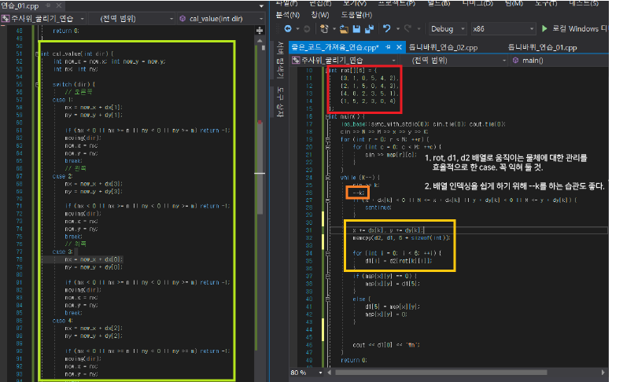

# 알고리즘 - 주사위 굴리기

### 이 문제를 풀기 위한 instruction

1. 4방향을 움직일 때 주사위의 변하는 전개도를 배열로 나타낼 수 있는가?

 - 이와 같이, 밑 방향으로 주사위를 굴리는 것이 왔다면,
    ```
    while(k){
    rot = [1,5,2,3,0,4];
    d2 <- d1[rot[i]]; } 
    ```
    반복으로 움직임을 표현!
 - 
 

2. 바닥이 0이면 주사위 밑면이 복사되고, 그렇지 않으면 바닥의 값이 주사위 밑면에 복사됨을 표현할 수 있는가?
 - 이건 쉬우니까...


 CODE
 ```
 #define _CRT_SECURE_NO_WARNINGS
#define MAX_MAP 21
#define MAX_ORDER 1001
#include<iostream>
#include<vector>
#include<cstring>

using namespace std;

struct dice {
	int x;
	int y;
	int move_cnt = 0;
	int road[2][6] = { 0,1,2,3,4,5 };
};

int n, m, x, y, k;
int map[MAX_MAP][MAX_MAP] = { -1, };
int order[MAX_ORDER] = { 0, };
int ans = 0;
dice now;

int dx[4] = { -1, 0, 1, 0 };
int dy[4] = { 0, 1, 0, -1 };

int cal_value(int dir);
void moving(int dir);

int main() {

	scanf("%d %d %d %d %d", &n, &m, &x, &y, &k);
	for (int i = 0; i < n; i++) {
		for (int j = 0; j < m; j++) {
			scanf("%d", &map[i][j]);
		}
	}

	now.x = x; now.y = y;
	for (int i = 0; i < k; i++) {
		scanf("%d", &order[i]);
		ans = cal_value(order[i]);
		if (ans != -1) {
			printf("%d\n", ans);
		}
	}
	
	
	return 0;
}

int cal_value(int dir) {
	int now_x = now.x; int now_y = now.y;
	int nx; int ny;

	switch (dir) {
		// 오른쪽
	case 1:
		nx = now_x + dx[1];
		ny = now_y + dy[1];
		
		if (nx < 0 || nx >= n || ny < 0 || ny >= m) return -1;
		moving(dir);
		now.x = nx;
		now.y = ny;
		break;
		// 왼쪽
	case 2:
		nx = now_x + dx[3];
		ny = now_y + dy[3];

		if (nx < 0 || nx >= n || ny < 0 || ny >= m) return -1;
		moving(dir);
		now.x = nx;
		now.y = ny;
		break;
		// 위쪽
	case 3:
		nx = now_x + dx[0];
		ny = now_y + dy[0];

		if (nx < 0 || nx >= n || ny < 0 || ny >= m) return -1;
		moving(dir);
		now.x = nx;
		now.y = ny;
		break;
	case 4:
		nx = now_x + dx[2];
		ny = now_y + dy[2];

		if (nx < 0 || nx >= n || ny < 0 || ny >= m) return -1;
		moving(dir);
		now.x = nx;
		now.y = ny;
		break;
	default:
		break;
	}

	if (map[nx][ny] == 0) {
		map[nx][ny] = now.road[1][5];
		
	}
	else {
		now.road[1][5] = map[nx][ny];
		map[nx][ny] = 0;
	}
	return now.road[1][0];
}

// 방향값을 주면 그대로 dice의 구조도가 달라지는 것.
void moving(int dir) {
	dice temp;
	temp = now;

	switch (dir) {
	// 오른쪽
	case 1:
		now.road[0][0] = temp.road[0][3];
		
		now.road[1][0] = temp.road[1][3];

		now.road[0][2] = temp.road[0][0];
		
		now.road[1][2] = temp.road[1][0];

		now.road[0][3] = temp.road[0][5];
		
		now.road[1][3] = temp.road[1][5];

		now.road[0][5] = temp.road[0][2];
		
		now.road[1][5] = temp.road[1][2];
		break;
		// 왼쪽
	case 2:
		now.road[0][0] = temp.road[0][2];
		now.road[1][0] = temp.road[1][2];
		
		now.road[0][2] = temp.road[0][5];
		now.road[1][2] = temp.road[1][5];
		
		now.road[0][3] = temp.road[0][0];
		now.road[1][3] = temp.road[1][0];
		
		now.road[0][5] = temp.road[0][3];
		now.road[1][5] = temp.road[1][3];
		
		break;
		// 위쪽
	case 3:
		now.road[0][0] = temp.road[0][4];
		now.road[1][0] = temp.road[1][4];
		
		now.road[0][1] = temp.road[0][0];
		now.road[1][1] = temp.road[1][0];
		
		now.road[0][4] = temp.road[0][5];
		now.road[1][4] = temp.road[1][5];
		
		now.road[0][5] = temp.road[0][1];
		now.road[1][5] = temp.road[1][1];
		
		break;
	// 아래쪽
	case 4:
		now.road[0][0] = temp.road[0][1];
		now.road[1][0] = temp.road[1][1];
		
		now.road[0][1] = temp.road[0][5];
		now.road[1][1] = temp.road[1][5];
		
		now.road[0][4] = temp.road[0][0];
		now.road[1][4] = temp.road[1][0];
		
		now.road[0][5] = temp.road[0][4];
		now.road[1][5] = temp.road[1][4];
		
		break;
	default:
		break;
	}
}

```

# 19. 12. 25(수)
 오늘은 문제를 기존보다는 빨리 풀었지만, 복사와 이동의 차이를 몰라 헤맸던 하루였다. 좀 더 효율적인 코드를 짜고, PS와 CS를 동시에 잘 할 수 있는 사람이 되기를~~