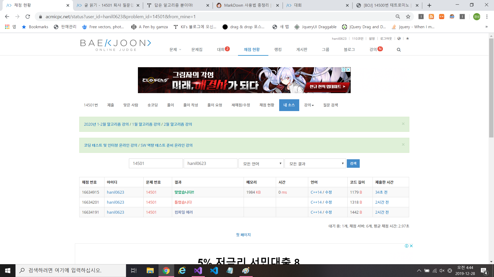

# 알고리즘 - 퇴사

 - 1. DFS로 풀 수 있는 문제와 DP로 풀 수 있는 문제 사이의 연관성을 찾아보기
    - "최대 이익" 이라는 표현은 divide and conquer 로 DP로 풀 수 있는 항목이였음을 인지하자.
    - 나는 결국 완탐이라고 생각하여 DFS를 돌렸으나 효율성이 떨어졌음. 10줄이면 풀 코드를 60줄에?
 - 2. DFS로 푼다고 가정할 때 4방향 탐색같은 조건문을 어디에 넣고 종료조건은 어떻게 넣는지에 대해서 다시 한번 생각해보기.
    - CODE (밑의 논리대로 완탐을 적용해야 함을 인지)
    ```
    void dfs(){
        노드에 갔을 때 수행 실행 (next 작업)
        if(종료조건){ 종료 코드 };
        else{
            for(노드 리프로 들어가는 코드){
                ___if(노드 리프로 들어갈 때 들어가야 할 조건)___
                dfs(i+1)
                (next 작업에 대한 prev 작업 실행)
            }
        }
    }
    ```

    퇴사 Full Code
```
#define _CRT_SECURE_NO_WARNINGS
#define MAX 15
#include<iostream>
#include<algorithm>
#include<vector>
#include<cstring>

struct info {
	int talk_date;
	int talk_coin;
};

using namespace std;

vector<info> order;
int profit; int max_pro;
int checked[MAX] = { 0, };
int n;

//void dfs(int today, int);
void dfs_ver2(int today);
int main() {
	info temp;
	cin >> n;
	for (int i = 0; i < n; i++) {
		scanf("%d %d", &temp.talk_date, &temp.talk_coin);
		order.push_back(temp);
	}


	for (int i = 0; i < order.size(); i++) {
		if (i + order[i].talk_date <= order.size()) {
			dfs_ver2(i);
		}
		memset(checked, 0, sizeof(checked));
		profit = 0;
	}
	printf("%d\n", max_pro);
	return 0;
}

void dfs_ver2(int today) {
	checked[today] = 1;
	profit += order[today].talk_coin;
	max_pro = max(profit, max_pro);

	// 종료 조건
	if (today >= order.size() || ((today + order[today].talk_date) - 1 > n - 1)){
		return;
	}
	else {
		for (int i = today + order[today].talk_date; i < order.size(); i++) {
//			i += order[i].talk_date;
			if (i + order[i].talk_date - 1 < order.size() && checked[i] == 0) {
				dfs_ver2(i);
				profit -= order[i].talk_coin;
				checked[i] = 0;
			}
			
		}
	}
}
```

# 19. 12. 28(토)
 - 플룻 연습이 빡셌던 하루, 뭐든지 정신없이 살자. 지금 보낸 보람찬 하루는 몇십만 이상의 가치가 있음을 인지하기
 - 내일은 DP로 어떻게 풀었는 지에 대한 분석하기.
 - 밤새며 푼 기쁜 순간
 
