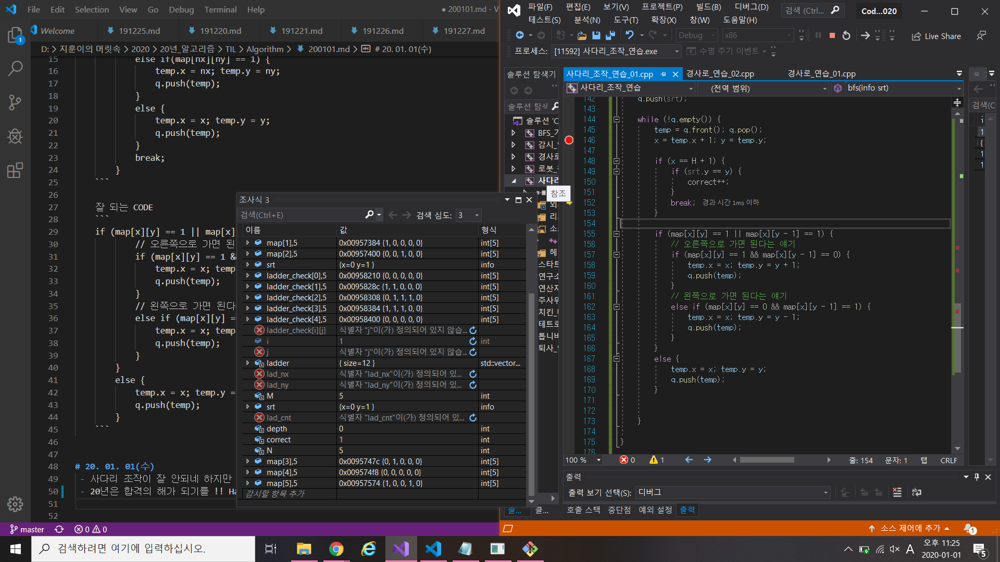

# 알고리즘 - 사다리 조작
 - 1. 사다리를 조작하기 위해 어디에 사다리를 놓을 수 있는지 판단하는 부분
 - 2. 사다리 게임을 시작하는데 양 방향이 갈 수 있는 곳인지 판단하는 부분
    : 왼쪽 방향으로 가거나 오른쪽으로 가거나 하는 코드의 잘못된 예와 좋은 예를 구분할 수 있다.

    잘못된 예시 CODE
    ```
    for (int i = 0; i < 2; i++) {
			nx = x + dx[i]; ny = y + dy[i];
			if (ny < 0 || ny >= N ) continue;
			if (map[x][y] == 1 && i == 0) {
				temp.x = nx; temp.y = ny;
				q.push(temp);
			}
			else if(map[nx][ny] == 1) {
				temp.x = nx; temp.y = ny;
				q.push(temp);
			}
			else {
				temp.x = x; temp.y = y;
				q.push(temp);
			}
			break;
		}
    ```

    잘 되는 CODE
    ```
    if (map[x][y] == 1 || map[x][y - 1] == 1) {
			// 오른쪽으로 가면 된다는 얘기
			if (map[x][y] == 1 && map[x][y - 1] == 0) {
				temp.x = x; temp.y = y + 1;
				q.push(temp);
			}
			// 왼쪽으로 가면 된다는 얘기
			else if (map[x][y] == 0 && map[x][y - 1] == 1) {
				temp.x = x; temp.y = y - 1;
				q.push(temp);
			}
		}
		else {
			temp.x = x; temp.y = y;
			q.push(temp);
		}
    ```


# 20. 01. 01(수)
 - 사다리 조작이 잘 안되네 하지만 거의 완성한듯. 내일 하자 내일.
 - 20년은 합격의 해가 되기를 !! Happy New Year!
  
        
     