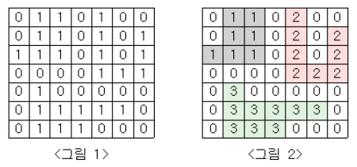

# 알고리즘 - 인구 이동
 1. 단순 배열문제라고 생각하여 시뮬레이션으로 생각하는 오류를 범했던 문제
 2. 이전의 bfs 문제는 check가 0이면 바로 퍼져나가는 단순한 문제였지만 이 문제는 특정 조건을 만족해야 퍼질 수 있는 시스템
 3. 
  - 위 사진의 문제(단지 번호 붙이기)와 비슷한 bfs의 영역, 즉 바이러스가 퍼지는 숙주의 영역을 구분하고 영역끼리 연산을 해야 했던 시스템.
  - 이를 위해 가장 중요한 것은 check == 0인 곳만 bfs를 적용시키고, 모든 배열을 순회하여야 한다.
  - 그리고, 바이러스가 퍼지지 않는다면(자기 자신만 퍼짐) 변수를 추가하여 check = 0으로 만들어 줄 swch 변수가 필요했던 문제이다.
  - 큐에 push 할 때 동시에 vector에 push를 함으로써 퍼지는 영역에 대한 관리를 할 수 있었던 문제이다.
 4. 근데 너무 느리다. 어떻게 하면 빠르게 풀 수 있을까?
  - 아, for{ for{ bfs() }} 인데 큐에 push 할 때 sum에 합해버리면 time이 줄어드는구나
  - 괜히 한번 더 해서 O(N*list.size())가 되버려서 시간이 늦은거임. 기존 O(N^2)로 풀 수 있는 문제인데
  - 하지만 check 배열을 써서 바이러스가 한번 퍼진 곳은 퍼지지 않게 하는 원리는 익혔음 ㅎㅎ

CODE
```
/* 200103 */
#define _CRT_SECURE_NO_WARNINGS
#include<iostream>
#include<vector>
#include<queue>
#include<cstring>
using namespace std;

int map[51][51] = { 0, };
int check[51][51] = { 0, };

struct info {
	int x, y;
};
int N, L, R, cnt = 0, sum = 0, avg = 0, res = 0, counting = 1;
int swch = 0, exit_cnt = 0;
int dx[4] = { -1, 0, 1, 0 };
int dy[4] = { 0, 1, 0, -1 };

vector<info> list;
void bfs(info srt, int);
void initialize(int, int);

int main() {
	int i, j;
	info start;
	cin >> N >> L >> R;

	for (i = 0; i < N; i++) {
		for (j = 0; j < N; j++) {
			scanf("%d", &map[i][j]);
		}
	}
	

	while (1) {
		for (int i = 0; i < N; i++) {
			for (int j = 0; j < N; j++) {
				start.x = i; start.y = j;
				if (check[i][j] == 0) {
					bfs(start, counting++);
					if (swch == 0) {
						// 연합국이 자기밖에 없을 경우 원상태화
						check[i][j] = 0;
						counting--;
						
						// 퍼지지 않음의 수를 카운트해보자.
						exit_cnt++;
					}
					else {
						initialize(i, j);
					}
					swch = 0;
				}
			}
		}
		
		memset(check, 0, sizeof(check));
		counting = 1;
		if (exit_cnt == N*N) {
			printf("%d\n", res);
			break;
		}
		res++;
		exit_cnt = 0;
	}
}

void initialize(int x, int y) {
	int sum = map[x][y];
	for (int i = 0; i < list.size(); i++) {
		sum += map[list[i].x][list[i].y];
	}
	avg = sum / (list.size() + 1);

	for (int i = 0; i < list.size(); i++) {
		map[list[i].x][list[i].y] = avg;
	}
	map[x][y] = avg;
	avg = 0; list.clear();
}
void bfs(info srt, int count) {
	info temp, temp2;
	queue<info> q;
	int x, y, nx, ny;
	q.push(srt);
	check[srt.x][srt.y] = count;

	while (!q.empty()) {
		temp = q.front(); q.pop();
		
		for (int i = 0; i < 4; i++) {
			x = temp.x; y = temp.y;
			nx = x + dx[i]; ny = y + dy[i];
			if (0 > nx || nx >= N || 0 > ny || ny >= N) continue;
			
			int dist = abs(map[x][y] - map[nx][ny]);
			
			if (L <= dist && dist <= R && !check[nx][ny]) {
				temp2.x = nx; temp2.y = ny;
				swch = 1;
				q.push(temp2);
				list.push_back(temp2);
				check[nx][ny] = count;
				
			}
		}
	}
}
```


## 20. 01. 04(토)
 - 연주회 연습 때문에 바쁘지만 하루 한 개 커밋은 필수로 해야 한다.
 - 근면함은 능력이 될 수 있다고 생각한다.
