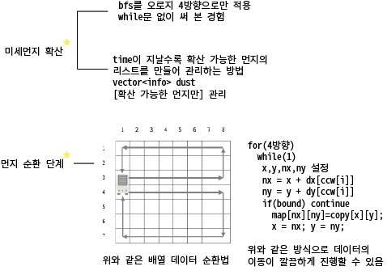

# 알고리즘 - 미세먼지 안녕!
 

 CODE
 ```
 #define _CRT_SECURE_NO_WARNINGS
#define RCMAX 51
#include<iostream>
#include<queue>
#include<vector>
#include<cstring>
using namespace std;

struct info {
	int x, y;
};
int dx[4] = { -1, 0, 1, 0 };
int dy[4] = { 0, 1, 0, -1 };
int cw[4] = { 1, 2, 3, 0 };
int ccw[4] = { 1, 0, 3, 2 };

int R, C, T, time = 1, dsize = 0, cleaner_count = 0;
int map[RCMAX][RCMAX] = { 0, };
int temporary[RCMAX][RCMAX] = { 0, };
int check[RCMAX][RCMAX] = { 0, };

info srt, cleaner[2];
queue<info> dirt_list;
vector<info> extension_list;

void bfs(info srt);
void cleaning();
int cal_dust();

int main() {

	cin >> R >> C >> T;
	for (int i = 0; i < R; i++) {
		for (int j = 0; j < C; j++) {
			scanf("%d", &map[i][j]);
			if (!(map[i][j] == 0 || map[i][j] == -1)) {
				srt.x = i; srt.y = j;
				check[srt.x][srt.y] = 1;
				extension_list.push_back(srt);
			}
			else if (map[i][j] == -1) {
				cleaner[cleaner_count].x = i; cleaner[cleaner_count++].y = j;
			}
		}
	}
	while (time <= T) {
		
		dsize = extension_list.size();
		for (int i = 0; i < dsize; i++) {
			bfs(extension_list[i]);
		}
		
		for (int i = 0; i < R; i++) {
			for (int j = 0; j < C; j++) {
				if (map[i][j] == -1) continue;
				map[i][j] += temporary[i][j];
				temporary[i][j] = 0;
			}
		}
		

		// 공기 정화
		cleaning();
		extension_list.clear();
		for (int i = 0; i < R; i++) {
			for (int j = 0; j < C; j++) {
				srt.x = i; srt.y = j;
				if (map[i][j] / 5 >= 1) {
					extension_list.push_back(srt);
				}
			}
		}
		memset(temporary, 0, sizeof(temporary));
		memset(check, 0, sizeof(check));
		time++;
	}
	
	printf("%d\n", cal_dust());
	return 0;
}

int cal_dust() {
	int sum = 0;
	for (int i = 0; i < R; i++) {
		for (int j = 0; j < C; j++) {
			if (map[i][j] == 0 || map[i][j] == -1) continue;
			sum += map[i][j];
		}
	}
	return sum;
}
// 와 특정 방향으로 미는 작업을 어떻게 하지?
void cleaning() {
	// 별 방법이 없네. 하지만 for(while()) 루프 + copyArr을 이용하여
	// 최대한 효율적인 코딩을 하는 방법은 있다.
	int x, y, nx, ny;
	memcpy(temporary, map, sizeof(map));
	
	
	x = cleaner[0].x; y = cleaner[0].y + 1;
	map[x][y] = 0;
	for (int i = 0; i < 4; i++) {
		while (1) {
			nx = x + dx[ccw[i]]; ny = y + dy[ccw[i]];

			if (nx < 0 || nx >= R || ny < 0 || ny >= C) break;

			if (nx == cleaner[0].x && ny == cleaner[0].y) break;

			map[nx][ny] = temporary[x][y];

			x = nx; y = ny;
		}
		if (nx == cleaner[0].x && ny == cleaner[0].y) break;
	}

	// clockwise 청소
	x = cleaner[1].x; y = cleaner[1].y + 1;
	map[x][y] = 0;
	for (int i = 0; i < 4; i++) {
		while (1) {
			nx = x + dx[cw[i]]; ny = y + dy[cw[i]];

			if (nx < 0 || nx >= R || ny < 0 || ny >= C) break;

			if (nx == cleaner[1].x && ny == cleaner[1].y) {
				
				break;
			}

			map[nx][ny] = temporary[x][y];

			x = nx; y = ny;
		}
		if (nx == cleaner[1].x && ny == cleaner[1].y) break;
	}

}
void bfs(info srt) {
	int x, y, nx, ny;
	int dir_cnt = 0;
	queue<info> q;
	info temp, temp2;
	q.push(srt);
	check[srt.x][srt.y] = 1;

	temp = q.front(); q.pop();
	x = temp.x; y = temp.y;
	for (int i = 0; i < 4; i++) {
		nx = x + dx[i]; ny = y + dy[i];
		if (nx < 0 || nx >= R || ny < 0 || ny >= C || map[nx][ny] == -1) continue;
		
		temp2.x = nx; temp2.y = ny;
		if ((map[x][y] / 5) >= 1 && map[nx][ny] == 0 && check[nx][ny] == 0) {
			extension_list.push_back(temp2);
			check[nx][ny] = 1;
		}
		dir_cnt++;
		temporary[nx][ny] += map[x][y] / 5;
		
	}
	map[x][y] -= (map[x][y] / 5) * dir_cnt;
}
```

 ## 20. 01. 06(월)
  - 1. SSAFY가 시작했지만 개들 만큼 열심히 할 수 있다~
  - 2. 골드 까진 티어를 올려보자
