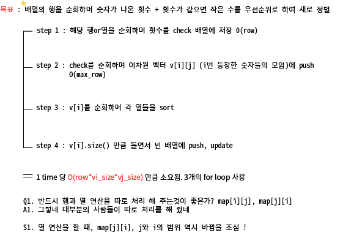

# 알고리즘 - 이차원 배열과 연산



CODE
```
#define _CRT_SECURE_NO_WARNINGS
#include<iostream>
#include<vector>
#include<algorithm>
#include<cstring>
using namespace std;

int map[101][101] = { 0, };

int cnt = 0, idx = 1, row_size = 0, col_size = 0, max_row = 0, max_col = 0;
int r, c, k, time = 0;
void calculate(int row_size, int col_size, int mode);

int main() {
	cin >> r >> c >> k;
	for (int i = 1; i <= 3; i++) {
		for (int j = 1; j <= 3; j++) {
			scanf("%d", &map[i][j]);
		}
	}
	
	row_size = 3; col_size = 3;
	max_row = row_size;
	max_col = col_size;
	while (1) {
		if (map[r][c] == k) { break; }
		if (time > 100) { time = -1; break; }
		if (max_row >= max_col) {
			calculate(max_row, max_col, 0);
		}
		else {
			calculate(max_row, max_col, 1);
		}
		if (max_row > 100) { max_row = 100; }
		if (max_col > 100) { max_col = 100; }
		time++;
	}
	
	printf("%d\n", time);

	return 0;
}

void calculate(int row_size, int col_size, int mode) {
	vector<vector<int> > v;
	int maxchk = 0, idx = 1, trow = 0, tcol = 0;
	int temp[101][101] = { 0, };
	int check[101] = { 0, };

	// R 연산
	if (mode == 0) {

		for (int i = 1; i <= max_row; i++)
		{
			// 행을 temp에 받고, 행의 숫자 횟수를 check에 저장,
			// 숫자 중 가장 큰 숫자를 저장한다.
			for (int j = 1; j <= max_col; j++) {
				//temp[i][j] = map[i][j];
				if (map[i][j] == 0) continue;
				check[map[i][j]]++;
				//maxnum = max(maxnum, map[i][j]);
			}

			// 벡터가 터지지 않게 할당
			for (int z = 0; z <= 100; z++) {
				vector<int> temp;
				v.push_back(temp);
			}

			// check 배열의 1에서 3까지 돌면서
			for (int k = 1; k <= 100; k++) {
				maxchk = max(maxchk, check[k]);
				// check[1] = 2가 있다면
				if (check[k]) {

					// 2번 나온 벡터만 보관하는 v에 해당 숫자 k를 push.
					v[check[k]].push_back(k);
				}
			}
			// 이땐 121를 적용하면, v[1] = {2}고, v[2]는 {1}이 있겠지.

			// temp에 늘리고, R과 C 연산을 적용한 다음 map에 넣어야겠지.
			// 이전에 해당 벡터를 열 별로 소팅해야함.
			for (int g = 0; g < v[g].size(); g++) {
				sort(v[g].begin(), v[g].end());
			}

			// temp에 넣는 작업
			for (int m = 1; m <= maxchk; m++) {
				for (int p = 0; p < v[m].size(); p++) {
					temp[i][idx++] = v[m][p];
					temp[i][idx++] = m;
				}
			}
			//col_size = idx;
			tcol = max(tcol, idx -1);
			idx = 1;
			v.clear();
			memset(check, 0, sizeof(check));
			// idx - 1은 새로 리모델링 한 행의 사이즈를 알 수 있다.
		}
		max_col = tcol;
	}
	else {
		for (int i = 1; i <= max_col; i++) {
			// 한 열을 받았다고 가정하고 여기엔 check에 업뎃이 되어있음.
			for (int j = 1; j <= max_row; j++) {
				//temp[j][i] = map[j][i];
				if (map[j][i] == 0) continue;
				check[map[j][i]]++;
				//maxnum = max(maxnum, map[j][i]);
			}
			// 벡터가 터지지 않게 할당
			for (int z = 0; z <= 100; z++) {
				vector<int> temp;
				v.push_back(temp);
			}
			for (int k = 1; k <= 100; k++) {
				maxchk = max(maxchk, check[k]);
				// check[1] = 2가 있다면
				if (check[k]) {

					// 2번 나온 벡터만 보관하는 v에 해당 숫자 k를 push.
					v[check[k]].push_back(k);
				}
			}
			for (int g = 0; g < v.size(); g++) {
				sort(v[g].begin(), v[g].end());
			}

			// temp에 넣는 작업
			for (int m = 1; m <= maxchk; m++) {
				for (int p = 0; p < v[m].size(); p++) {
					temp[idx++][i] = v[m][p];
					temp[idx++][i] = m;
				}
			}
			row_size = idx - 1;
			trow = max(trow, row_size);
			idx = 1;
			v.clear();
			memset(check, 0, sizeof(check));
		}
		max_row = trow;
	}
	// 마무리가 된 temp 배열을 최종 map에 복사하는 작업.
	memcpy(map, temp, sizeof(temp));
	// 연산을 한 결과에서 제일 긴 row, col을 전역변수에 복사하는 작업
}
```

## 20. 01. 07(화)
 - 생각 한 대로 구현할 줄 아는 능력이 이주 전 보다는 늘었음을 확인
 - 시뮬 문제도 조만간 3시간 컷 가능 할 듯!?
 - 좀 더 열심히 하자
