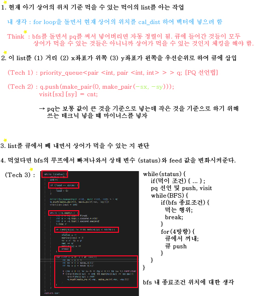

# 알고리즘 - 아기 상어
 

CODE
```
#define _CRT_SECURE_NO_WARNINGS
#include<iostream>
#include<cstring>
#include<vector>
#include<algorithm>
#include<queue>
using namespace std;

int n, ans = 0;
int map[21][21];
int visit[21][21] = { 0, };
int move_x[] = { -1, 0, 0, 1 };
int move_y[] = { 0, -1, 1, 0 };
int sx = 0, sy = 0;


int solution();

int main() {

	cin >> n;
	for (int i = 0; i < n; i++) {
		for (int j = 0; j < n; j++) {
			scanf("%d", &map[i][j]);
			if (map[i][j] == 9) {
				sx = i; sy = j;
			}
		}
	}

	ans = solution();
	printf("%d", ans);
	return 0;
}


int solution() {
	int cnt = 0, sec = 0;
	int ssize = 2, feed = 0, status = 1;

	while (status) {
		status = 0;
		cnt++;

		if (feed == ssize) { 
			ssize++;
			feed = 0;
		}

		priority_queue<pair <int, pair <int, int> > > q;
		q.push(make_pair(0, make_pair(-sx, -sy)));
		visit[sx][sy] = cnt;


		while (!q.empty()) {
			int s = -q.top().first;
			int x = -q.top().second.first;
			int y = -q.top().second.second;
			q.pop();

			if (map[x][y] != 0 && map[x][y] < ssize) {
				feed++;
				status = 1;
				map[sx][sy] = 0;
				sx = x; sy = y;
				sec += s;
				map[x][y] = 0;
				break;
			}

			for (int i = 0; i < 4; i++) {
				int ns = s + 1;
				int nx = x + move_x[i];
				int ny = y + move_y[i];

				if (nx < 0 || nx >= n || ny < 0 || ny >= n) continue;
				if (visit[nx][ny] != cnt && map[nx][ny] <= ssize) {
					visit[nx][ny] = cnt;
					q.push(make_pair(-ns, make_pair(-nx, -ny)));
				}
			}
		}
	}
	return sec;
}
```
성현이 코드 가지고 공부를 함. ㅎㅎ

## 20. 01. 08(수)
 - 특정 조건을 make_pair 써서 pq에 순서를 때려 박으면 자동정렬을 시켜 준다는 아주 좋은 자료구조가 있었음을
   몸으로 느낌
 - 노래나 신나게 부르고 오자~~ 
 - 연주회 연습은 언제하지