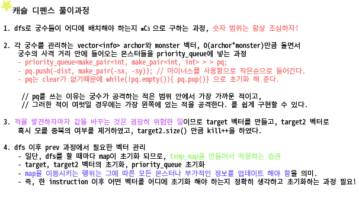

CODE
```
#include<iostream>
#include<algorithm>
#include<vector>
#include<queue>
#include<cstring>

using namespace std;
int map[16][16] = { 0, };
int temp_map[16][16] = { 0, };
bool check[16] = { false, };
int N, M, D, ans = 0;
struct info {
	int x, y;
};
vector<info> archor;
vector<info> monster;
vector<info> target;
vector<info> target2;
info temp;

void push_map();
bool all_kill();
void dfs(int srt, int depth);
void kill_monster();
void distinct();
void prev_instruction();

int main() {
	cin >> N >> M >> D;
	for (int i = 0; i < N; i++) {
		for (int j = 0; j < M; j++) {
			cin >> map[i][j];
			if (map[i][j]) {
				temp.x = i; temp.y = j;
				monster.push_back(temp);
			}
		}
	}
	for (int i = 0; i < 5; i++) {
		dfs(i, 0);
		memset(check, 0, sizeof(check));

	}
	cout << ans << endl;
	return 0;
}

void dfs(int srt, int depth) {
	info t;
	if (depth == 3) {
		// 디버깅에서 check배열의 경우의 수가 제대로 되는지 확인해봐라
		for (int i = 0; i < M; i++) {
			if (check[i]) {
				t.x = N; t.y = i;
				archor.push_back(t);
			}
		}
		kill_monster();
		return;
	}
	for (int i = srt; i < M; i++) {
		if (!check[i]) {
			check[i] = true;
			dfs(i, depth+1);
			check[i] = false;
			archor.clear();
			prev_instruction();
			
		}
	}
}
void prev_instruction() {
	info t;
	monster.clear();
	for (int i = 0; i < N; i++) {
		for (int j = 0; j < M; j++) {
			if (map[i][j]) {
				t.x = i; t.y = j;
				monster.push_back(t);
			}
		}
	}
}
void kill_monster() {
	int kill = 0; 
	priority_queue<pair <int, pair<int, int> > > pq;
	info t;
	// 여기선 항상 temp_map의 상태는 초기화가 되어줘야 제대로 진행가능.
	memcpy(temp_map, map, sizeof(map));

	while (1) {
		target.clear();
		target2.clear();
		if (all_kill()) { break; }
		for (int i = 0; i < archor.size(); i++) {
			
			for (int j = 0; j < monster.size(); j++) {
				int sx = monster[j].x; int sy = monster[j].y;
				int dist = abs(archor[i].x - sx) + abs(archor[i].y - sy);
				if (dist <= D) {
					pq.push(make_pair(-dist, make_pair(-sy, -sx)));
				}
			}
			if (pq.size() > 0) {
				// pq에 값이 없을 경우도 생각해봐야함 반드시.
				t.x = -pq.top().second.second; t.y = -pq.top().second.first;
				target.push_back(t);
				
			}
			while (!pq.empty()) { pq.pop(); }
		}
		// 이거하면 target2엔 중복되지 않는 제거해야할 몬스터의 리스트가 있다.
		distinct();


		for (int i = 0; i < target2.size(); i++) {
			temp_map[target2[i].x][target2[i].y] = 0;
			kill++;
		}
		push_map();
	}
	ans = max(ans, kill);
}

void push_map() {
	monster.clear();
	info t;
	for (int i = N - 1; i >= 1; i--) {
		memcpy(temp_map[i], temp_map[i - 1], sizeof(temp_map[i - 1]));
	}
	for (int i = 0; i < M; i++) {
		temp_map[0][i] = 0;
	}
	// 맵을 한칸밀고 몬스터의 위치를 새로 업데이트해줘야함.
	for (int i = 0; i < N; i++) {
		for (int j = 0; j < M; j++) {
			if(temp_map[i][j]){ 
				t.x = i; t.y = j;
				monster.push_back(t);
			}
		}
	}
}
void distinct() {
	int visit[16][16] = { 0, };
	for (int i = 0; i < target.size(); i++) {
		if (visit[target[i].x][target[i].y]) { continue; }
		target2.push_back(target[i]);
		visit[target[i].x][target[i].y] = 1;
	}
}
bool all_kill() {
	for (int i = 0; i < N; i++) {
		for (int j = 0; j < M; j++) {
			if (temp_map[i][j]) { return false; }
		}
	}
	return true;
}
```

# 20. 01. 27(월)
 - 최근 답지를 보는 문제가 많아 PS는 해도 늘지 않네 싶었지만
   오늘은 깔끔하게 풀어서 다행인 하루
 - 그동안 풀면서 느낀 경험들을 잘 녹여 풀었던 기쁜 하루~
   내일 상시신청 고고싱