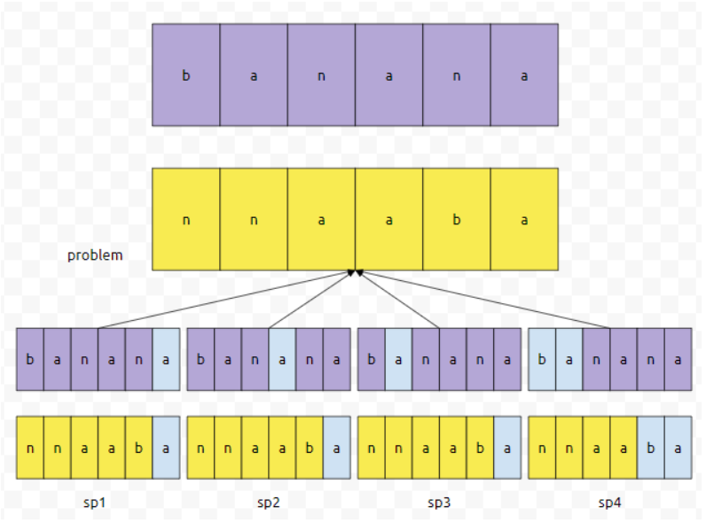

## 알고리즘 - 인구 이동(2)
 - 1. 배열 안에서 인접한 곳 끼리 데이터의 교환이 이뤄지는 경우 고려해야 할 점.
     : 데이터 교환이 이뤄지는 범위는 한 군데만 있는 것인가? (국가로 따지면 국가가 하나만 있는 것이 아니란 점)

     : 데이터의 교환이 이뤄지지 않을 경우에 어떻게 원상태로 변수를 돌릴 것인가?

## 알고리즘 - 아나그램(paper cut)
 - 1. str = banana // ptr = nnaaba 가 있고,
      banana를 가위로 몇 군데 잘라서 적절히 옮기면 nnaaba가 되는지 구하는 알고리즘이다.
     : dp로 구한다고는 하는데 정확한 코드는 봐야 알겠지만 이런 문제의 핵심은
     : ptr의 제일 끝 문자 a를 선택한다.
     : str의 문자 중 a와 같은 문자가 있는지 체킹한다.
     : 선택이 되면 다음 문자 b와 같은 문자가 있는지 체킹하는 방식으로, 부분문제임을 알 수 있다.
  

## 알고리즘 - 부분수열의 합
 - 1. 일단 부분수열이라 함은 떨어져 있어도 부분적으로 수열이 됨을 뜻한다. 반드시 붙어 있을 필요는 없다는 점 명심하자.
 - 2. 부분수열이 되고 안되고 판단할 수 있으니까, 완탐을 돌기 위해서 제일 좋은 것은 Bitmask 라는 점!
     : 비트마스크의 기본적인 CODE
     ```
     for(int i=1; i< (1 << n); i++){
          for(int j=0; j<n; j++){
               if(i & (1 << j)){
                    // 이 부분은 부분수열이 됨을 뜻하니까
                    // 여기서 원하는 logic을 구현하면 된다.
               }
          }
     }
     ```


## 20. 02. 08(토)
 - 반복된 문제를 푸는 것도 좋은데, 다양한 문제를 풀어서 bfs와 dfs의 어떤 고정관념적인 틀을 깨는 것도 중요하다.
 - 한 3 ~ 4일 정도는 간단한 문제를 많이 풀어보는 형식으로 하자.
 

