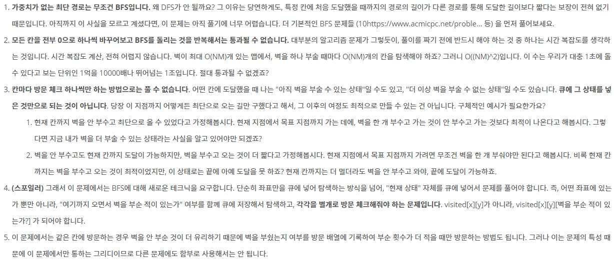

## 알고리즘 - 벽 부수고 이동하기
 - 1. bfs에 대한 새로운 테크닉을 요구로 했던 좋은 문제이다.
    : 벽을 부쉈는지에 대한 여부를 3차원 배열인 check[x][y][wall]로 나타내야 했다는 점.
    : 다음 갈 곳이 벽이고, 벽을 부순 적이 없는 경우에는 다음 갈 곳을 큐에 넣어준다.
    : 다음 갈 곳이 벽이고, 벽을 부순 적이 있는 경우에는 그냥 넘어간다.
    : 다음 갈 곳이 벽이 아니고, 벽을 부순 적이 있다면 체크해줘야 하는게
        빈 땅 = 벽을 부수고 온 땅일 수도 있고 + 벽을 부수지 않고 온 땅 + 벽을 부순 땅 의 세가지 경우다.
        근데 벽을 부순다고 map[nx][ny] = 0으로 만들어 주는 것이 아니라, 벽을 부순 횟수를 +1을 하고 
        큐에 nx, ny 좌표를 넣어버린다.
    : 그러니까, 부순적이 없고 다음 갈 곳이 벽이라면, 이 경우에만 갈 수 있도록 큐에 넣는 작업을 따로 하는 부분이 인상적이였다.
 

 - 2. bfs를 할 때, next.dist = now.dist + 1;의 형식으로 최단경로를 찾는 점 !! 다시 알 수 있었다.

 ## 20. 02. 10(월)
  - 볼때마다 새로운 유형의 문제가 나오니까 새롭지만, 더욱 열심히 해야 겠다.

        
