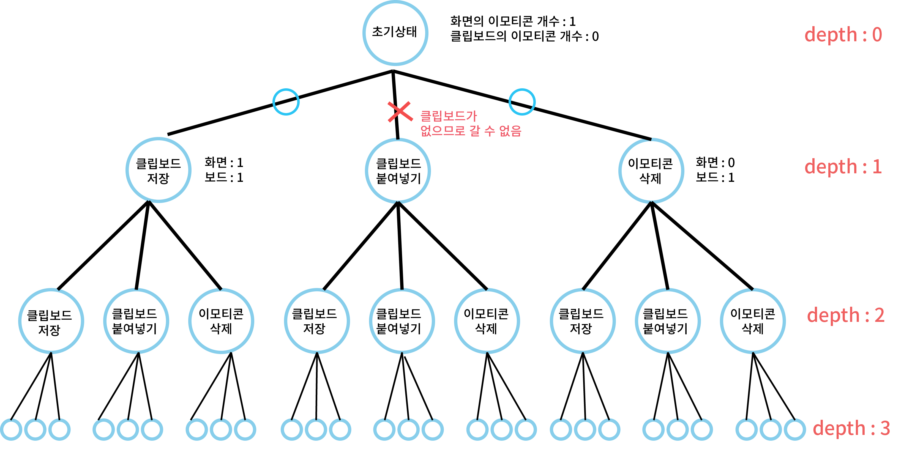

## 알고리즘 - 이모티콘
 - 메모리 초과와 런타임 에러가 나는 이유에 대해 깊이 있게 공부할 수 있었던 문제.
 - BFS를 쓸 때 상황에 맞게 조건을 잡아 나가는 것, check 배열을 어떤 상태로 설명해야
   가장 간단명료하게 표현할 수 있는지에 대한 경험을 얻을 수 있었다.
 
 - 티스토리 블로그에 좀 더 자세히 설명되어 있다.

## 20. 02. 17(월)
 - 메모리 초과와 런타임 에러에 대해 고민할 수 있는 중요한 하루였다.
 - 사소해 보이지만, check 배열의 조건 체킹, 큐에 넣는 행위, check 배열 표시의 인덱스는 삼위일체로 표현한다는 것을 알았다.