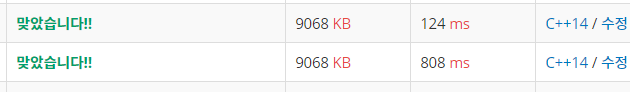

## 알고리즘 - 최단경로
   1. 다익스트라 알고리즘을 사용해 볼 수 있는 문제이다.
    - 노드 수가 많을 경우에는 priority_queue를 사용하여 문제를 푼다는 것을 명심하자.
    - 기본 코드를 적어보면
    ```
    vector<int> dijkstra(int str, int vertex){
        priority_queue<pair<int, int>> pq;
        pq.push(make_pair(0, str)); // 시작점의 노드번호의 가중치는 0이다.
        vector<pair<int, int>> distance(vertex, INF); // vertex개의 노드 INF 초기화
        
        while(!pq.empty()){
            int cost = -pq.front().first;
            int curVertex = pq.front().second;
            pq.pop();

            if(distance[curVertex] < cost) continue;

            for(int i=0; i<graph[curVertex].size()){
                int neighbor = graph[curVertex][i].first;
                int neighborDist = cost + graph[curVertex][i].second;

                if(distance[neighbor] > neighborDist){
                    distance[neighbor] = neighborDist;
                    pq.push(make_pair(-neighborDist, neighbor));
                }
            }
        }
        return distance;
    }
    ```
  2. 리턴을 받은 result 배열을 출력하는 과정에서 endl과 cout을 사용한다는 것에 대한 차이
   
   왜 빠른 cout을 쓰는 것이 속도가 더 빠를까?
   정답은 C++(iostream)과 C(stdio)의 버퍼 싱크를 맞추는데 상당한 시간이 걸리기 때문이라고 한다. 그래서
   ios_base::sync_with_stdio(false); cin.tie(0);을 해 주면, 오로지 C++의 버퍼만 사용하기 때문에 좀 더 빠른 접근이 가능하다.

***
## 20. 02. 19(수)
 - 다익스트라 역시 일반 bfs와 다를바 없다는 점을 알 수 있었다.