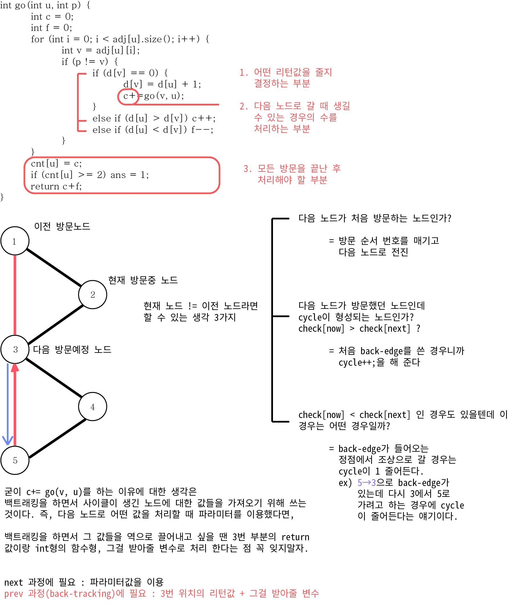

## 알고리즘 - 텀 프로젝트
 - 이 문제는 사이클을 이루고 있는 집합과 그렇지 않은 집합을 분리하여 생각하되,
   각 정점마다 dfs를 돌려 사이클을 찾는 방법을 쓴다면 O(V(V+E))로 TLE 발생을 할 수 있다.(노드가 10만개)
 - 그래서 사이클의 여부는 dfs 트리 한 번으로 찾을 수 있으며,
   단방향일 경우와 양방향일 경우가 다르게 적용된다.
   먼저 단방향일 경우, **서브스패닝트리의 루트**에 도달할 수 있으면 다시 루트부터 내려갈 수 있기 때문에 사이클이 생긴다.

 - 클론 코딩을 하면서 알아야 할 포인트는 두가지이다.
 ```
 int dfs(int i){
     if(visit[i]) // sub-spanning tree 에서의 사이클 발생 여부를 체킹하기 위함.
        return i; // 임시용
     if(check[i]) // 전체 node 방문 여부를 체킹하기위한 것.(영구)
        return 0;
     visit[i] = 1;
     check[i] = 1;
     int next = dfs(v[i]); 
     // 여기까지만 하면 사이클이 발생한다면 스패닝트리의 루트노드가 나오게 됨.
     // 사이클이 발생하지 않는다면 check에서 걸려, 0의 값이 나오게 된다.
     // 1. 사이클이 발생하는 조건을 나타내는 코드를 쉽게 작성 할 수 있는가?
     visit[i] = 0; // 사이클이 발생하는 루트노드를 알았기에 원상복귀처리(prev)
     if(next > 0){ // 사이클이 발생한다면?
        ans[i] = 1; // 사이클이 발생하는 sub-spanning tree의 노드를 입력해주고
        if(next != i){
            return next; 
            // 2. SST의 세부 노드요소들을 리턴하는데, 루트까지 리턴하기 위함이다.
            // 루트로부터 자식까지 갔다가 루트와 같게되면 리턴 0을 처리함.
        }

     }
     return 0;
 }
 ```
 이후 ans = 0인 i만 찾아주면 사이클이 발생하지 않는 graph 요소들을 모두 알 수 있다.

 ## 알고리즘 - Cactus? Not Cactus? (양방향 graph의 cycle)
  - 위에서 단방향 Graph의 Cycle 찾는 법은 dfs를 돌면서 check 된 곳을 다시 간다면 이 부분이 cycle이 됨을 쉽게 알 수 있었다.
  - 이 문제는 dfs에서 next의 과정이 아닌 prev 과정(back tracking)의 테크닉을 익힐 수 있는 중요한 문제였다.
  - 특히나 back-edge의 개념이 어떤 것인지 좀 더 명확하게 알 수 있었다.

  
  ---

 ## 알고리즘 - 음악 프로그램
  - 이 문제는 위상정렬(Topology Sorting)을 익힐 수 있는 문제였다.
  - .jpg)
  - 위 그림처럼 선수강제도라던지 어떤 노드를 거쳐야만 다음 노드로 갈 수 있는 __노드간 우선순위__ 가 있을 때 쓸 수 있는 **Sorting**이다.
  - 위상 정렬의 기본로직은 degree 배열을 선언 한 후, 우선순위가 높을 수록 숫자가 0에 가깝고 낮을수록 숫자가 높다. 인풋 배열을 받을 때 degree[node]++ 를 해 준다.
  - 그 후, degree가 가장 0에 가까운 순서(위상이 가장 높은)대로 큐에 push 한다.
  - 큐가 empty 될 때 까지 큐에서 노드를 뽑은 후, 해당 노드의 degree를 -1 해 준다.
    = 즉, if(degree[next]-- == 0){ q.push(next); ans.push_back(next)}
  - 그리고 **ans 배열의 size가 n과 다르다면 cycle이고, 정렬을 할 수 없는 경우**임을 명심하자.

  
## 20. 02. 21(금)
 - 감탄스러운 코드이다. 얼마나 잘 이해하고 있으면 이런 코드를 작성할 수 있을까?