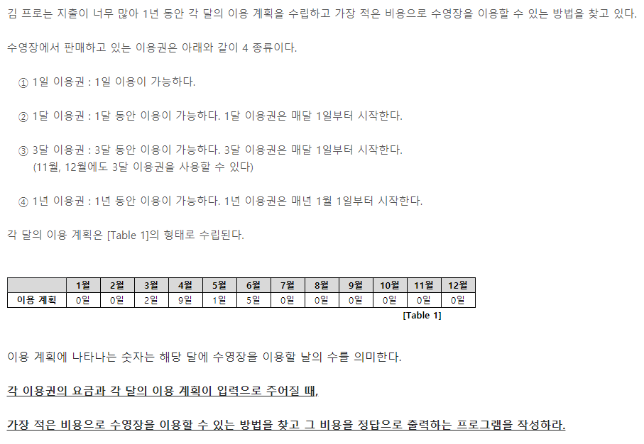

## 알고리즘 - 핀볼 게임
 - 1. 예전 상시때 밭을 심는 로봇 청소기도 그렇고, 이 문제를 dfs로 접근하면 터짐을 알아야 한다.
     ```
     for(int i=0; i<zero.size(); i++){
         while(1){
             if(종료조건) break;
             // 4방향이라면
             for(int j=0; j<4; j++){
                 // 방향 바꿔가면서 logic 수행
             }
         }
     }
     ```
 - 2. 각 핀볼이 들어올 때 마다 핀볼 종류에 따른 dir의 변화를 함수로 만들어 일일이 바꿔야 하는 날코딩력도 중요했다.
 - 3. 블로그의 글 처럼, pair<pair<int, int>, pair<int, int>> hole[5]를 만들어서 first가 있다면 second 좌표로 가고
      아니라면 first의 좌표로 반환을 하는 신선한 상황에 걸맞는 자료구조를 구경했다.

## 알고리즘 - 수영장
  - 1. DP문제라는 것은 알았는데 어떻게 푸는 지 몰랐던.. 문제이다.
    
  - 여기서 dp[i] = i달째까지 이용한 금액 중 가장 적은 금액을 말한다.
    ```
    for(int i=3; i<15; i++){
        // 가령 5달까지의 최소금액은 
        // [4달까지의 최소 금액 + 5달째를 1일씩 끊은 case]
        // [4달까지 최소 금액 + 5달째를 한달로 끊은 case]
        // [2달까지의 최소 금액 + 3달치를 한번에 끊은 case]로 구할 수 있다.
        // 단, 단위가 같은 한달끼리 먼저 계산 후 계산하는 방법을 취하면 좀 더 효율적으로 구할 수 있다.
        dp[i] = min(min(dp[i-1] + dp[i]*day, dp[i-1] + month), dp[i-3] + 3month);
    }
    
    ans = min(dp[14], year);
    ```


## 20. 03. 03(화)
 - 힘들어도 어쩔 수 없다. 끝까지 버텨내고 이겨내야 한다.