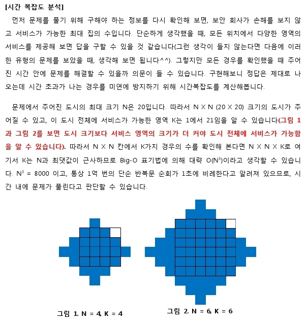

## 알고리즘 - 홈 방범 서비스
 - 1. depth 별 bfs를 사용하는 기본 틀에서 조건을 갖춰 bfs를 쓰는 방법에 대해 알았다. 다시 한번 적어보면
    ```
    queue<pair<int, int>> q;

    while(depth--){
        int qsize = q.size();
        while(qsize--){
            for(int i=0; i<4; i++){
                int nx = x + dx[i];
                int ny = y + dy[i];
                if(nx < 0 || nx >= n || ny < 0 || ny >= n || check[nx][ny]) continue;
                check[nx][ny] = 1;
                q.push({nx, ny});
            }        
        }
    }
    ```

 - 2. 이 문제의 핵심은 모든 좌표를 돌아가면서 depth를 n까지 진행시켜 보면서 서비스 회사의 이익이 돌아갈 때 방범 서비스를 이용하는 최대 이용 집을 찾는 것이다.
 시간 복잡도를 계산하는 방법 다시 생각 해 볼 것.

 - 3. 이 문제에서, 마름모 꼴로 모든 구역을 덮기 위해선 depth가 n이 아닌 n+1까지 돌아야 덮을 수 있음을 그림으로 확인 할 수 있다.
 


 ## 20. 03. 10(화)
  - 다시 한 번 생각 해 볼 것.. 풀었으나 시간복잡도 계산은 제대로 하지 못한듯. 