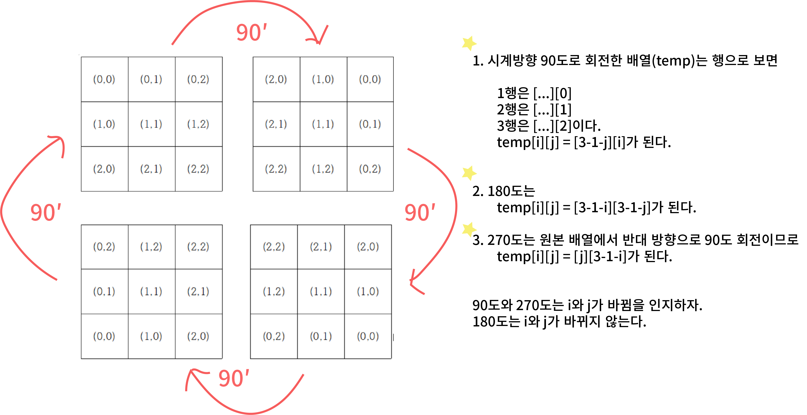

## 알고리즘 - 스티커 붙이기

 - 스티커나 색종이를 붙이는 행위는 dfs에서 자주 등장하는 단골문제임을 깨달았다.
   하지만, 이런 상황에서 써야 하는 전형적인 format을 파악하지 못했고, 구현에 시간이 오래 걸려 포기한 문제이다.


 - m*n의 도형을 90도씩 돌려 저장해야 하는 상황이 있었는데, 순간 그 테크닉의 원리를 파악하지 못했다.
   : 도형을 돌릴 땐 반드시 생각하자.
   


## 알고리즘 - Gaaaaaaaaarden

 - 1. Object : 배양액을 뿌려도 되는 구역, 배양액 종류(R, G)
      이를 구분하여 각 구역 별 배양액의 종류를 모든 경우를 틀어 지정할 수 있는가?

   2. Time : 같은 시간에 한 곳에 두 배양액 이상이 퍼진 경우 꽃을 피울 수 있다.
      하지만, 다른 시간에는 한 배양액이 다른 배양액으로 퍼질 수 없다는 점.
      Time 개념이 나왔다면, depth 별 bfs를 적용 할 수 있었어야 한다.
   
   3. 배양액이 퍼질 때 Object가 여러개이다. 즉, 배양액 3개가 동시에 한 곳에 퍼지게 하는 경우는 제외해야 하며,
      배양액이 동시에 퍼질 때, 오로지 빈 곳만 퍼지게 하는 것이 좀 더 좋은 조건이였다.
      즉, 보통 if(조건) continue의 방법을 썼었는데 이 경우가 오히려 독이였다.
      Object가 많은 경우에는 특정 경우에만 퍼질 수 있는 조건을 달아서 코딩하는 습관을 들이자.

CODE
```
#include<iostream>
#include<vector>
#include<algorithm>
#include<queue>
#include<cstring>

using namespace std;
struct info {
	int state;
	int color;
};
int N, M, G, R;
int ans = 0, maxans = -1;
info map[51][51] = { 0, };
int flower[51][51] = { 0, };
vector<pair<pair<int, int>, int> > v;
queue < pair<pair<int, int>, int > > q;
int check[51][51] = { 0, }; 
int dx[4] = { -1,0, 1, 0 };
int dy[4] = { 0, 1, 0, -1 };
void bfs();
void dfs(int G, int R);

int main() {
	
	cin >> N >> M >> G >> R;
	for (int i = 1; i <= N; i++) {
		for (int j = 1; j <= M; j++) {
			cin >> map[i][j].state;
			// 0은 호수, 1은 배양액 ㄴㄴ, 2는 배양액 ok
			if (map[i][j].state == 2) {
				v.push_back({ { i,j }, 0 });
			}
		}
	}
	// 배양액을 모두 사용하여 너는 여기 너는 저기를
	// 정해놓고 시뮬돌려야겠지?
	dfs(G, R);
	cout << maxans << '\n';
	return 0;
}

void dfs(int G, int R) {
	vector<int> ind;
	// v에는 지금 배양액을 뿌릴 수 있는 땅의 Obj가 있어.
	for (int i = 1; i <= 10; i++) {
		if (i <= G) {
			ind.push_back(0);
		}
		else if(G < i && i <= G+R) {
			ind.push_back(1);
		}
		else {
			ind.push_back(2);
		}
	}

	sort(ind.begin(), ind.end());

	while (1) {
		int tempnum = 0;
		for (int i = 0; i < v.size(); i++) {
			if (ind[i] == 1 || ind[i] == 0) {
				tempnum++;
			}
		}
		if (tempnum == G + R) {
			for (int i = 0; i < v.size(); i++) {
				int x = v[i].first.first;
				int y = v[i].first.second;
				// v[i]랑 ind랑 매칭해볼거야.
				v[i].second = ind[i];
				if (v[i].second == 0) {
					//map[v[i].first.first][v[i].first.second] = 1;
					map[x][y].color = 1;
					q.push({ {x, y},  1 });
					check[x][y] = 1;
				}
				else if (v[i].second == 1) {
					//map[v[i].first.first][v[i].first.second] = 2;
					map[x][y].color = 2;
					q.push({ {x, y}, 2 });
					check[x][y] = 2;
				}
			}

			bfs();
			memset(check, 0, sizeof(check));
			memset(flower, 0, sizeof(flower));
			maxans = max(maxans, ans);
			for (int i = 1; i <= N; i++) {
				for (int j = 1; j <= M; j++) {
					map[i][j].color = 0;
				}
			}
		}
		if (!next_permutation(ind.begin(), ind.end())) break;
	}
}

void bfs() {
	ans = 0;
	while (1) {
		int qsize = q.size();
		if (qsize == 0) break;
		while (qsize--) {
			int x = q.front().first.first;
			int y = q.front().first.second;
			int color = q.front().second;
			q.pop();
			if (map[x][y].color == 3) { continue; }
			for (int i = 0; i < 4; i++) {
				int nx = x + dx[i];
				int ny = y + dy[i];
				if (nx <= 0 || nx > N || ny <= 0 || ny > M || map[nx][ny].state == 0) continue;
				if (map[nx][ny].color != 0) continue;
				if (check[nx][ny] + color >= 4) continue;
				if (color == check[nx][ny]) continue;
				check[nx][ny] += color;
				q.push({ { nx, ny }, color });
			}
		}

		for (int i = 1; i <= N; i++) {
			for (int j = 1; j <= M; j++) {
				map[i][j].color = check[i][j];
				if (map[i][j].color == 3 && flower[i][j] == 0) {
					flower[i][j] = 1;
					ans++;
				}
			}
		}

	}
}
```

## 20. 03. 21(토)
 - 아쉽기도 하면서 기분도 멜랑꼴리한 하루. 마지막에 1문제는 풀었다는게 다행이다.
 - 종이접기 문제에 대한 대비를 했더라면 2솔도 충분히 노릴 수 있었다고 생각한다.
 - 노력을 더 하면 풀 수 있을 것 같단 느낌이 든다. 더욱 노력하자
 - 시험 끝~