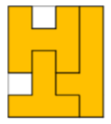
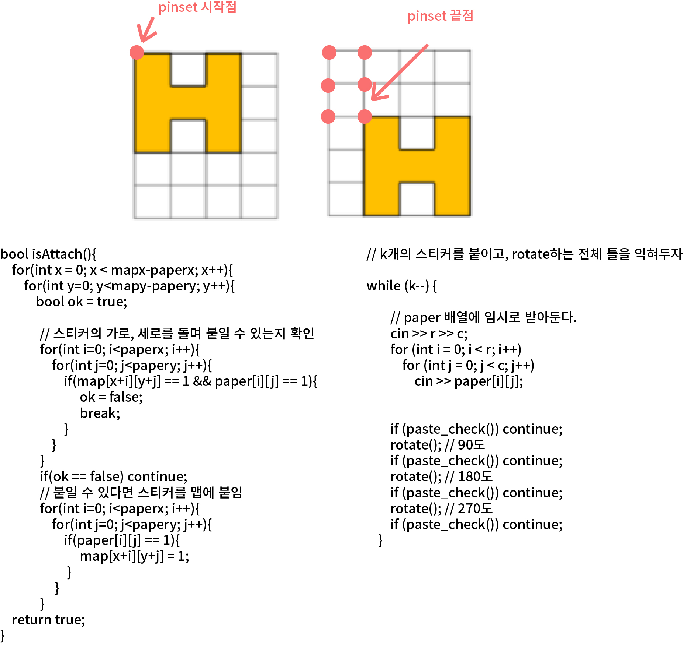

## 알고리즘 - 스티커 붙이기
 - 어떤 모양을 지정된 map 안에 붙여넣는 작업은 보통 완탐으로 볼 수 있다.
 - 먼저, 스티커 붙이기를 보자.

 - Type 1 
    
    색종이, 스티커를 겹쳐서 넣을 수 있느냐 아니냐가 중요한 Point로 볼 수 있고.
    이 문제에선 겹치는 도형이 없다. 하지만, 모든 칸에 지정한 도형을 대어 보고
    도형이 넣을 공간이 없다면 도형을 회전하는 순서가 있다.

    -> 이 경우는 pinset을 생각하자.
    BaarkingDog 님의 풀이를 참조하여 공부 https://blog.encrypted.gg/
    


 ## 알고리즘 - 타일 붙이기
  - Type 2
    지정된 Size의 타일을 붙이는데 겹쳐서 넣을 수 있는 경우.
    원하는 것은 DFS를 돌며 특정 노드의 모양이 나오는 경우인지 아닌지 체킹하는 목적이다.
    즉, 위의 Type 1처럼 Pinset을 잡아 4중 for문을 돌 것인지? dfs를 쓸 것인지?
    판단 잘 하고 써야 한다.
    CODE
    ```
    #include<iostream>

    using namespace std;
    int test_case, n, m;
    int board[51][51]; // 정답의 경우고
    int tempmap[51][51];
    int check[51][51];
    bool ok = false;
    bool checking();
    void dfs(int px, int py, bool fin);

    int main() {
        cin >> test_case;
        for (int T = 0; T < test_case; T++) {
            ok = false;
            cin >> n >> m;
            for (int i = 0; i < n; i++) {
                for (int j = 0; j < m; j++) {
                    cin >> board[i][j];
                }
            }
            if (checking()) {
                cout << "YES" << '\n';
                return 0;
            }
            dfs(0, 0, false);
            if (ok == true) { cout << "YES" << '\n'; }
            else { cout << "NO" << '\n'; }
        }
        return 0;
    }

    bool checking() {
        for (int i = 0; i < n; i++) {
            for (int j = 0; j < m; j++) {
                if (tempmap[i][j] > 0 && board[i][j] == 0) {
                    return false;
                }
                if (tempmap[i][j] == 0 && board[i][j] == 1) {
                    return false;
                }
            }
        }
        return true;
    }
    void dfs(int px, int py, bool fin) {
        if (fin == true) {
            ok = true;
            return;
        }
        
        for (int i = px; i <= n - 2; i++) {
            for (int j = 0; j <= m - 2; j++) {
                if (check[i][j]) continue;
                check[i][j] = 1;
                tempmap[i][j]++; tempmap[i + 1][j]++;
                tempmap[i][j + 1]++; tempmap[i + 1][j + 1]++;
                if (checking()) {
                    fin = true;
                }
                dfs(i, j, fin);
                check[i][j] = 0;
                tempmap[i][j]--; tempmap[i + 1][j]--;
                tempmap[i][j + 1]--; tempmap[i + 1][j + 1]--;
            }
        }
    }
    ```

## 20. 03. 22(일)
 - 아직 풀어야 할 문제가 남아있다.
 - 색종이 붙이기, 무기 공학, 테트로미노, 종이 조각 문제류는
   4중 for문, dfs를 좀 더 다양하게 활용 할 수 있는 문제이다.
   특히 DP로 풀 수 있는 류는 굉장히 어렵다.
   
 - Gaaaaaaarden 역시도 어떻게 하면 효율적으로 풀 수 있는지에 대한 코드를 다듬을 필요가 있다.
 - 모양을 붙이는 행위에 대해 좀 더 자세하게 배운 하루

            