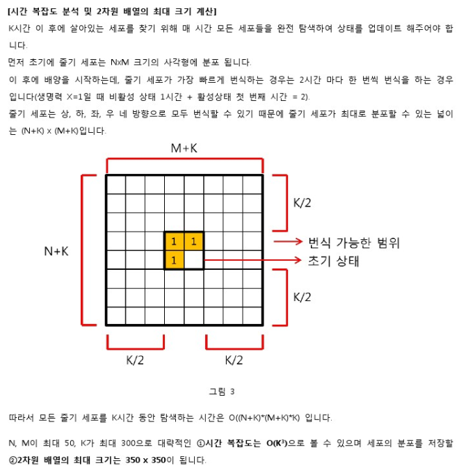

## 알고리즘 - 줄기세포배양(2)

 - 1. 4방향 퍼지는 개념을 무조건 bfs다! 라고 생각하지 말 것.

 - 2. state가 여러가지인 경우, 제일 우선적으로 짤 코드는 state별로 조건문을 거는 것이고, 이 ***조건이 바뀔 때 마다 해당 멤버 변수들을 모두 문제의 조건에 맞게 변형***하는 것을 잊지 말자.

 - 3. 번식(확장) 이라는 개념이 존재하면, 반드시 한 공간을 한 개의 Object가 점령하는 것인지? 아니면 두 개 이상의 Object가 점령하는지 문제에서 말 하지 않아도 조건 처리를 할 준비를 해야 한다.

 ```
 ex) 1개의 Object가 점령하는 경우는, next_map[nx][ny]의 해당하는 값이 0이겠지?
 // 
 if(next_map[nx][ny] == 0){
     // 조건 처리
 }
 // else 쓰지말고 else if 모든 조건 다 써 주자. 습관으로 들여라.
 else if(next_map[nx][ny] != 0 && next_map[nx][ny] < map[nx][ny]){
     // 가장 중요한 경우, 여러개의 값이 한 공간을 점령하려고 드는 경우, 가장 큰 값으로 바꿔주는 코드인데 항상 인지하고 다녀라.
     next_map[nx][ny] = map[nx][ny];
     
     // 그 외 나머지 멤버변수들 조건에 따라 초기화!
 }
 ```
 
 - 4. 시간복잡도, 공간복잡도를 보며
 
  - 세포가 가장 빨리 번식하는 것은 생명력이 1일때다.
  - 그럼, 2초마다 한칸씩 번식하니까, k초면 k/2 만큼 한 공간으로 번식할 것이며, 위와 같은 그림이 나올 것이다.

  - k초마다 번식하는 줄기세포를 모두 탐색하려면 줄기세포의 넓이를 알아야겠지.
    위의 그림과 같이 K^3이 나옴을 알아야 하며 N과 M이 350정도의 상수이므로 O(k^3)에 큰 영향은 미치지 못한다. 
    그럼, 최대 k는 300이니까, 300^3 = 27,000,000 이다. 
    0.3초의 시간이 걸리니 최대의 경우에도 시간 안에 통과가 된다. 
    그럼, k^3의 방법으로 풀어도 된다는 소리가 되니까 이 방법(완탐)을 쓰는 것이다.


## 20. 03. 25(수)
 - 어떤 문제를 볼 때 시간복잡도 계산은 중요하다. 계산해 보려고 노력하고 스코프 파악을 한 다음 풀자.
 - 만약, 완탐을 할 때 되지 않는 경우가 있다면 (maximum 값 대입) = 최대, 최소를 만족하지 못하는 node는 버리는 방법으로 연산을 줄여라.
  