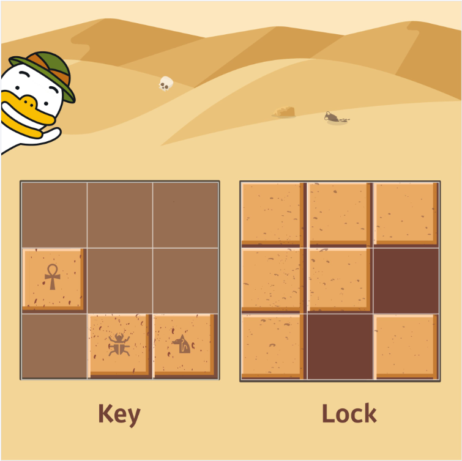

## 알고리즘 - 특이한 자석(2)

 - 1. 어떤 Object가 회전이라는 Action을 취할 때, 다른 Object가 영향을 받아 연쇄작용을 하는 상황에 대하여 해결방안은?

 - 자석같은 특별한 상황에서는 Pointer의 개념을 따로 사용하여, 실제 좌석을 회전시키는 것이 아니고 포인터 값만 바꿔주었다.

 - 즉, [회전]의 Action을 취할 때, 반드시 축이 해당 Object여야만 하는지 반드시 판단해야만 한다. 
 
   Pointer 값만 바꿔주어도 [회전]의 Action은 표현할 수 있다는 중요한 사실!

 - [연쇄작용]을 표현하기 위해서는, pivot Object로 부터 양방향 진행을 한다. 오른쪽 한번, 왼쪽 한번.

 - [회전]을 굳이 한 Procedure로 나타내지 않아도 된다. 즉, [회전] = [방향 표시] → [회전] 의 과정으로 표시할 수 있음을 명심하자


 - 2. 환형 큐에서 특정 인덱스 범위를 넘어갈 때 처리법에 대한 공부를 했다.

    ```
    int next_pointer = point[num + mode];
	int now_idx, next_idx;
	if (now_pointer + 2 > 8) {
		now_idx = (now_pointer + 2) % 9 + 1;
	}
	else {
		now_idx = now_pointer + 2;
	}
	if (next_pointer + 6 > 8) {
		next_idx = (next_pointer + 6) % 9 + 1;
	}
	else {
		next_idx = next_pointer + 6;
	}
    ```

## 알고리즘 - 자물쇠

 - 작년 카카오 공채문제이다. 스티커 붙이기와 마찬가지인 문제인데 생각한 풀이법과 구현이 해설과 일치한 문제였다.

 - 

 - Lock 배열을 기존 Size의 x3배 크기로 설정 후, 평행이동을 시킨다.
 
 - 이후, 색종이 붙이듯 모든 경우를 돌아가며 빗대어 보고 판단하는 작업이다.

 - 이런 문제류가 삼성이고 카카오고 시뮬레이션류로 자주 나오니까 익혀둬야 한다.


## 20. 03. 26(목)
 - 좀 더 열심히 하자.