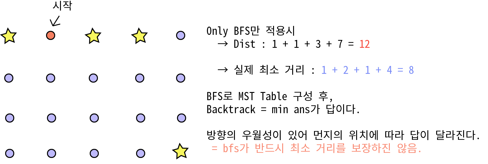

## 알고리즘 - 로봇 청소기(2)
 - 

 - 일단, 목적지 노드가 정확히 정해지지 않아 다익스트라는 쓸 수 없다.
 - 이걸 DP로 풀 수 있다는데,, 좀 더 연구해보자.
 - 핵심은 ***방향의 우월성***이 있으면 bfs는 최소 거리를 보장하지 않기에
 - dfs로 백트래킹 후 완탐을 해야 찾을 수 있다는 내용이였다.
 - 두 번째 풀지만 여전히 간과하기 쉽고 굉장히 좋은 문제이다.
 - 보통 DFS + BFS 지만, 이건 BFS + DFS인 참신한 문제.

 ## 20. 04. 09(목)
  - 계속 자소서 쓰자