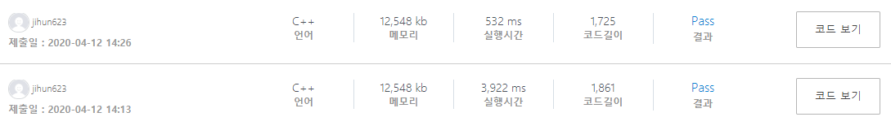

## 알고리즘 - 보호 필름(2)(속도 향상 Ver)

 - 1. 약품을 칠하지 않은 상태도 State에 포함시킬 줄 아는 관점을 가져라.
     - [약품칠 X, A로 칠함, B로 칠함] 의 3가지 State로 보는 관점!
    
 - 2. 이에 따라 dfs로 가지치는 방법에 대한 생각의 폭을 넓혀야 한다.
    ```
    int solve() {
        // 얘네는 들어가는 첫 depth의 성질을 가지치기 한 것이다.
        dfs(0, -1, 0);
        dfs(0, 0, 1);
        dfs(0, 1, 1);
        return ans;
    }

    void dfs(int depth, int state, int goal) {
        if (ans < goal) return;
        check[depth] = state;

        if (depth == d - 1) {
            //memcpy(temp_map, map, sizeof(map));
            //depth에 해당하는 행만 state로 바꿔볼까?
            if (!doing_now()) return;
            int cnt = 0;
            for (int i = 0; i < d; i++)
                if (check[i] != -1) cnt++;
            ans = min(ans, cnt);
            return;
        }
        // 다음 가지칠 때 들어갈 수 있는 node의 성질
        dfs(depth + 1, -1, goal);
        dfs(depth + 1, 0, goal + 1);
        dfs(depth + 1, 1, goal + 1);
    }
    ```

 - 3. DFS 할 때 memcpy(temp_map, map)은 굉장한 Time을 소요한다.
    
    시간단축을 하고 싶다면 temp_map 없이 답을 구하는 방법에 대해 연구해라.

    - 이전 값과 연속된 값의 여부를 판단하는 방법은 굳이 temp_map이 없어도 된다.
    
    ```
    bool doing_now() {
        int prev, cnt, now_state;
        bool pass;
        for (int j = 0; j < w; j++) {
            // prev = 3인 이유는 처음에 걸리지 않게 하는 임의의 수
            prev = 3; cnt = 0; pass = false;
            for (int i = 0; i < d; i++) {
                // 현재 state를 저장
                now_state = (check[i] == -1 ? map[i][j] : check[i]);

                // 이전 값과 현재 값이 같으면 cnt++
                if (prev == now_state)
                    cnt++;
                // 같지 않다면 현재 state를 prev 값에 저장시키고 cnt를 초기화
                else {
                    prev = now_state;
                    cnt = 1;
                }
                if (cnt >= k) {
                    pass = true;
                    break;
                }
            }
            if (!pass) return false;
        }
        return true;
    }
    ```

## 20. 04. 12(일)
 - 같은 문제를 여러번 보는 것 중요하다.. 속도 향상의 측면에서도 중요하다.
 - 근본 실력 늘리기. 첫번째 풀 때 보이지 않았던 관점이 보인다.