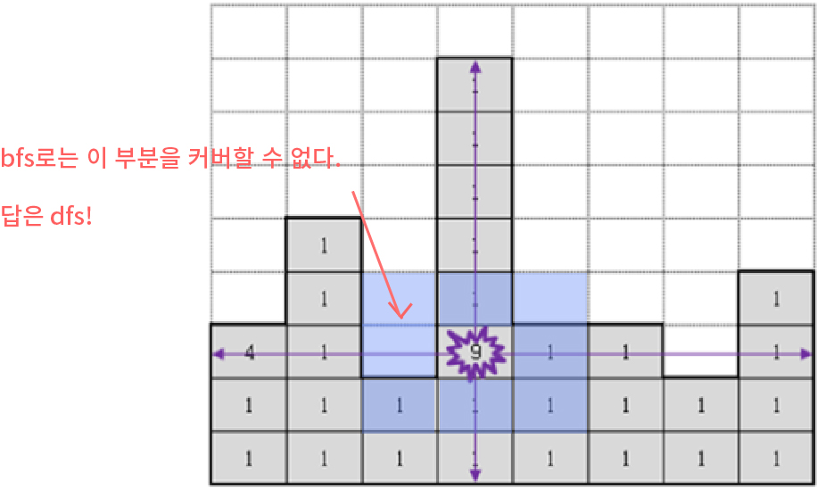

## 알고리즘 - 벽돌 깨기

 - 1. MAP이 있어도 bfs인지 dfs인지 판단을 잘 해야 한다.
     

     위 그림처럼, 화살표가 처리된 부분이 큐에 들어가야 다음 곳으로 퍼질 수 있는데 선별해서 큐를 넣는다고 해도 bfs로는 원하는 모양을 만들 수 없다.

     그래서, dfs로 풀어야 하고, 십자가 모양으로 퍼질 떄 유용한 테크닉은
     ```
     for(int i=0; i<4; i++){
         for(int mult = 0; mult < t; mult++){
             int nx = x + dx[i] * mult;
             int ny = y + dy[i] * mult;
             if(조건만족){
                 dfs(nx, ny);
             }
         }
     }
    ```

 - 2. 중복순열을 왜 생각하지 못했을까?
    : 중복순열을 nC1 + nC2 + nC3 .. nCn으로 잘못 생각하는 버릇이 있다.
    : 위 문제에서는 w개의 열 중에 중복하여 n개까지 뽑고, 순서 상관이 없다.

    : 중복순열, 중복조합 개념을 다시 알고 적재적소에 구현할 수 있는 준비를 해야겠다.

    중복순열 CODE
    ```
    void dfs(int depth) {
        if (depth == n) {
            memcpy(temp_map, map, sizeof(map));
            local_ans = 0;
            for (int i = 0; i < n; i++) {
                solve(check[i]);
            }
            ans = min(ans, local_ans);
            memcpy(map, temp_map, sizeof(temp_map));
            return;
        }
        for (int i = 0; i < w; i++) {
            check[depth] = i;
            dfs(depth + 1);
        }
    }
    ```
    : 폭탄처럼 연쇄작용으로 터지는 새로운 개념의 퍼짐 형태! 괜찮은 문제이다.


## 20. 04. 14(화)
 - 보내고 싶은 하루 역량의 70%만 실행한다 하더라도 실망하지 말자. 충분히 발전하고 있고, 내가 하는 행동이 옳은 길이라 생각한다. 자신에게 확신을 가지길