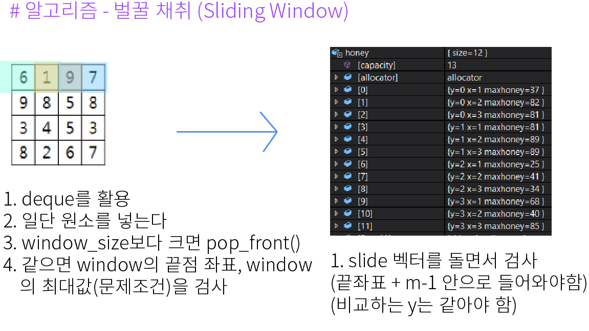

## 알고리즘 - 2048 (Easy, 2)
 
 1. dfs의 Snapshot 간 배열 값 유지를 위해서는 반드시 임시 배열을 ***★지역 변수★***로 저장해야 한다.

  - 스택에 재귀함수 별 저장을 할 때 각자 다른 공간에 저장이 되기 때문에 반드시 지역변수를 써야 한다. 제발!

 2. 배열에 있는 값들 중 한방향으로 밀때, ex) 0 0 2 0 1 5 0 2 → 0 0 0 0 2 1 5 2 로 밀기 위해서는

  - 0이 아닌 값들만 ★Queue★에 저장하는 테크닉이 새로웠다.

## 20. 04. 17(금)
 - 다시 풀어보자. 계속 풀어보고 내것으로 만들어야 한다. 사고를 확장시키고 능력을 키우자.
 - 복습은 최고의 공부이다.