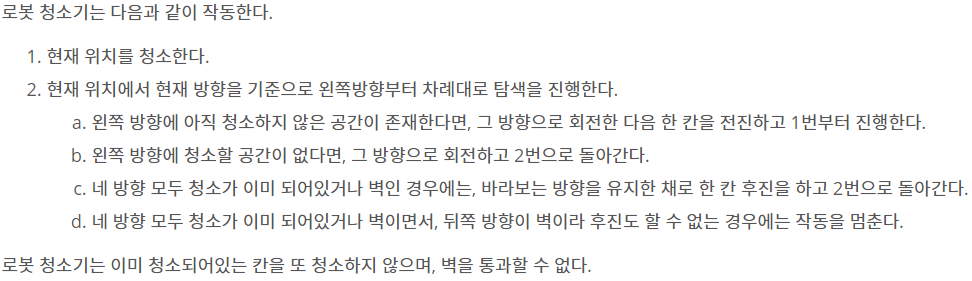

## 알고리즘 - 2048 (Easy, 2)
 
 1. dfs의 Snapshot 간 배열 값 유지를 위해서는 반드시 임시 배열을 ***★지역 변수★***로 저장해야 한다.

  - 스택에 재귀함수 별 저장을 할 때 각자 다른 공간에 저장이 되기 때문에 반드시 지역변수를 써야 한다. 제발!

 2. 배열에 있는 값들 중 한방향으로 밀때, ex) 0 0 2 0 1 5 0 2 → 0 0 0 0 2 1 5 2 로 밀기 위해서는

  - 0이 아닌 값들만 ★Queue★에 저장하는 테크닉이 새로웠다.


## 알고리즘 - 로봇 청소기

 1. 문제 풀 때, dfs로 풀기에는 깊이가 가늠되지 않아 bfs로 풀 생각

 2. 문제의 조건을 bfs 안의 세부 조건으로 잘 나타낸 듯. 이전보다 코드도 절약하고 풀 수 있게 됨.

 문제조건
 

 CODE
 ```
 void solve() {
	while (!q.empty()) {
		int x = q.front().first.first;
		int y = q.front().first.second;
		int dir = q.front().second.first;
		int cnt = q.front().second.second;
		int nextdir = (dir + 3) % 4;
		q.pop();

		int nx = x + dx[nextdir];
		int ny = y + dy[nextdir];
		
		if (nx < 0 || nx >= n || ny < 0 || ny >= m || check[nx][ny] || map[nx][ny] == 1) {
			if (cnt == 4) {
        // 4방향 다 막힐 경우, 기존 진행 방향의 반대 방향으로 진행
				// c번 처리 (d도 해야함)
				int nx = x - dx[dir];
				int ny = y - dy[dir];
        // 반대 방향이 벽이라면? 바로 종료.
				if (nx < 0 || nx >= n || ny < 0 || ny >= m || map[nx][ny] == 1) {
					break;
				}
				else {
					if (check[nx][ny] == 0) {
						check[nx][ny] = temp++;
					}
					q.push({ {nx, ny}, {dir, 0} });
				}
			}
      // 벽에 막힐 경우, cnt값과 방향만 바꿔 다시 넣어줌.
			else {
				q.push({ {x, y}, {nextdir, cnt + 1} });
			}
			continue;
		}
		check[nx][ny] = temp++;
		q.push({ {nx, ny}, {nextdir, 0} });
	}
}
```


## 20. 04. 17(금)
 - 다시 풀어보자. 계속 풀어보고 내것으로 만들어야 한다. 사고를 확장시키고 능력을 키우자.
 - 복습은 최고의 공부이다.