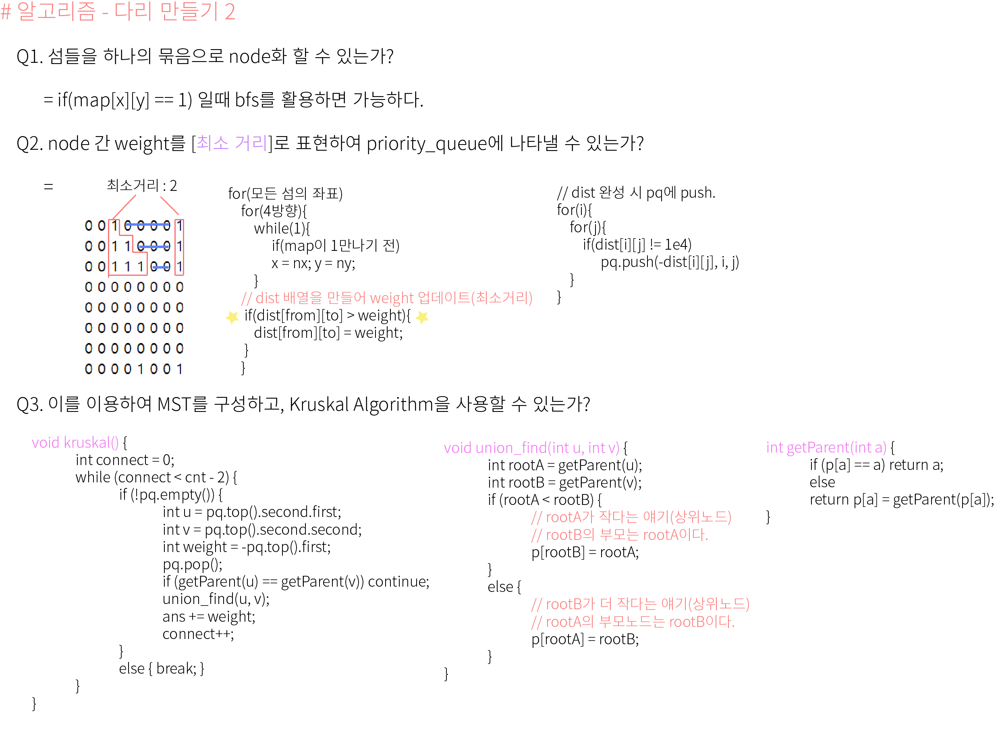

## 알고리즘 - 사다리 조작(2)
 
 - 1. 사다리 게임 실행 함수 만드는 법
    - if(x, y 값이 존재하고 가로이동변수가 0이라면 = 오른쪽 이동 후, 가로이동변수 c = 1)
    - else if(x, y는 없는데 x, y-1값이 있고, c = 0이면 왼쪽으로 이동 후, c = 1)
    - else (둘 다 아니라면 밑으로 내려가고, c = 0 해준다.)

 - 2. *** TLE *** 가 났던 이유는, mP3을 했기 때문이다. mC3을 하니까 AC 되었다.

## 알고리즘 - 원판 돌리기(2)

 - 1. ***연관된 것을 지운다*** 는 말은 bfs로 지울 수 있어야 함을 인지하는게 테크닉
      (DFS는 depth 가늠이 어려워 터질까봐 X)

 - 2. 원판 반시계 / 시계방향으로 회전하는거 테크닉 연습 완료

 - 3. 조건대로 구현만 하면 되는데 왜 1:30분이나 썼는지...

 ## 20. 04. 18(토)
  - 계속 풀어본다. 사소한거 하나까지도