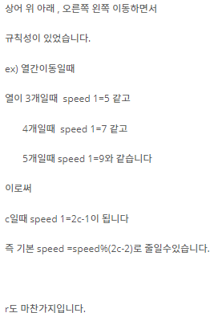

## 알고리즘 - 낚시왕(2)

 - 1. ***Vector 배열을 관리 하는 이유는, 한 공간(x, y) 안에 여러개의 값(Object)가 들어 갈 수 있기 때문이다.***

 -    ***여기서 어떤 Object를 삽입, 삭제 할 때, 무조건 push_back, pop_back을 하는 것은 굉장히 위험한 행동이다***
 -    ***(push_back)을 했던 Object를 다른 for loop에서 pop_back을 하는 예외처리 경우가 있기 때문***
 -    ***즉, 물리는 경우이다. next_map을 쓰지 않는 가정 하에, 어떤 공간에 삽입, 삭제를 한다고 할 때, 반드시***
 -    ***내가 원하는 공간(x, y) 벡터 안 정확한 원소번호만 삭제하는지, 삽입하는지 반드시 확인해야 한다.***
 -    ***무조건 pop_back()을 하지 말라는 얘기이다.***


 - 2. 일정 스피드를 가지고 특정 Line을 왔다갔다 거리는 경우, 수학적으로 이 값들을 줄일 수 있음을 명심하라.
    


## 알고리즘 - 스티커 붙이기(2)

 - 배열 돌리기 다시 한번 연습!
 ```
 for(int i=0; i<r; i++){
      for(int j=0; j<c; j++){
           // i, j의 순서를 바꾸지 않을거면, temp는 j와 i로, map은 그대로 써라.
           temp[j][i] = map[x - 1 - i][j];
      }
 }
```

- 스티커 붙이기 다시 한번 연습!
- 핀셋, 스티커 좌표를 따로 분리하여 생각할 수 있는가?
- 먼저 붙일 수 있는지 isattach 변수로 여부를 확인 후, 붙일 수 있다면 스티커를 붙인다.


## 20. 04. 20(월)
 - vector 배열을 관리하는 문제(여러개의 Object가 한 공간에 모이는 문제)를 풀 때 공통적으로 실수하는 부분 알아냄.
 - 중요한 실수 알게 되서 멘탈은 부서졌지만 다행.