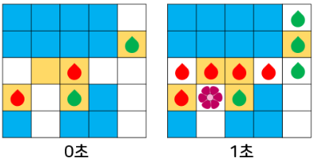

## 알고리즘 - Gaaaaaaaaaarden

 1. 특정 공간[(x, y), n개]에 n보다 작은 Object r개를 조합으로 구성하는 문제
    단, Object가 한개가 아니라 두개나, 그 이상일 수 있다는 점이 특이 케이스
    r개(r = a + b)이고, a와 b개를 쪼개서 적절하게 구성할 수 있는가?

    

    위 사진과 같이 구성하기 위해서는, Object가 2개이면 빈 공간까지 3개의 Object로 구성 가능.
    1) next_permutation을 쓸 경우 단 두 줄이면 가능하다.

    ```
    fill(ind + esize - g - r, ind + esize - r, 1);
	fill(ind + esize - r, ind + esize, 2);
    ```

    2) dfs(backtracking)을 쓸 경우엔 Object 개수 만큼 dfs 함수를 만드는 것이 포인트
      단, 재료가 필요하다.
      - object_a_ary[a], object_b_ary[b], isselect[a+b];
      ```
      void select_r(int idx) {
            if (idx == r) {
                ans = max(ans, bfs());
                return;
            }
            int cur = 0;
            if (idx != 0) cur = chosen_r[idx - 1] + 1;

            while (cur < esize) {
                // 마지막 Object를 select 하는 함수에서, select_g에서 선택한 값과 겹치지 않게 옮겨주는 작업
                if (isused[cur]) {
                    cur++;
                    continue;
                }
                isused[cur] = true;
                chosen_r[idx] = cur;
                select_r(idx + 1);
                isused[cur] = false;
                cur++;
            }
        }
        void select_g(int idx) {
            if (idx == g) {
                select_r(0);
                return;
            }
            int cur = 0;
            if (idx != 0) cur = chosen_g[idx - 1] + 1;
            while (cur < esize) {
                isused[cur] = true;
                chosen_g[idx] = cur;
                select_g(idx + 1);
                isused[cur] = false;
                cur++;
            }
        }
      ```

  2. Object 선택했으면 bfs 돌려야지.
   

   위 사진에서 1초 이내에 상태가 바뀌는 Object를 처리하려고 한다면,

   ***★check 배열 대신 pair<int, int> state[MAX][MAX] (time, color)를 이용하자★***

   time 비교법은 현재 now_time = state[x][y].time; next_time은 state[nx][ny].time으로 관리 가능하다.
   color 역시 마찬가지, now_color = state[x][y].color; next_color는 state[nx][ny].color이고

   ```
   // red와 green 역시 마찬가지.
   if(next_color == GREEN){
       if(now_color == RED && next_time == now_time + 1){
           // 꽃 피는 경우
       }
   }
   // 빈 곳인 경우?
   if(next_color == EMPTY){
       q.push();
   }
   ```

## 알고리즘 - 치킨 배달(2)

 - 거리 계산 = 단순 bfs만 쓰면 느리게 나온다.
 - 별 조건이 없다면, abs(cx-sx) + abs(cy-sy)인 맨하튼 거리로 계산하는 방식.
 - input 조건이 50*50인데 fill(&dist[0][0], &dist[0][0] + 50*50, 1e4) 를 해서 틀린 경우.
 - 반드시 input 조건보다 +1씩 하여 51*51로 계산하는 버릇 잡자.


## 20. 04. 21(화)
 - 폐관수련 딱 4달째 알고리즘 기반은 잡히는데 완벽하진 않다.
 - 프젝을 해야 하나... swea나 카카오 다른 문제를 풀어볼까. 고민중..

