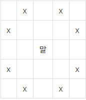

## 알고리즘 - 달이 차오른다, 가자
 
  - 한번의 bfs로 열쇠를 얻고 문을 여는 상황을 표현할 수 있다.

  - 키의 개수는 6개이므로, 비트마스크로 표현 시 111111, 2^6 = 64이다. 그래서 check 배열을 [64][MAX][MAX]로 나타낼 수 있다.

  - 문을 마주치는 상황과 키를 마주치는 상황을 3차원 키배열로 이용하는 센스를 요구하는 문제. 비트마스크 필수
    ```
    if(key & 1 << (int)(map[nx][ny] - 'A')){
        // 현재 keyset으로도 통과가 가능하므로
        check[key][nx][ny] = 1;
        q.push({{nx, ny}, {dist+1, key}});
    }
    else if(// 키를 마주친 경우){
        int newkey = key | 1 << (int)(map[nx][ny] - 'a');
        check[newkey][nx][ny] = 1;
        check[key][nx][ny] = 1;
        q.push({{nx, ny}, {dist+1, newkey}});
    }
    ```
  - 기존 열쇠 문제와는 다른 유형. nice한 문제이다.

## 알고리즘 - 말이 되고픈 원숭이

  - 일반적인 bfs 문제와 다른점은 기준점(x, y)에서

  

  위 사진처럼 방향을 이동할 수도, 4방향으로 이동할 수도 있다.

  - 실수한점 : 만약 말로 이동하는 횟수 제한이 없다면 bfs 함수 안에 for문을 두개 넣어서 풀어도 된다. 하지만, 중요한건 ***말로 이동할 수 있는 횟수의 제한***이 있다. 그래서, 횟수를 check 변수에 3차 배열로 넣어주고 if(horse >= k) continue; 를 적어주면 쉽게 풀 수 있는 문제.


## 알고리즘 - 불

  - 탈출 문제와 매우 비슷한 문제유형이다. 탈출 문제는 3차원 check 배열(고슴도치가 이동하기 전 물이 고슴도치의 자리를 차지한 경우 or X)로 나눠 풀었었고,

  - 이 문제는 ***bfs를 적용하기 전, 불의 좌표를 모두 큐에 넣어준 후, 사람의 좌표를 나중에 넣는 방식*** 을 사용했다. 이렇게 하면 불 → 사람 순서로 퍼짐이 보장된다.

  - 그리고 맵을 변형시키지 않고 오직 check 배열로만 컨트롤 해서 풀 수 있음을 확인받은 문제였다. 단, Object가 많을 경우, 각 Object 입장에서 가능한 Obj가 어떤 것인지 생각 꼼꼼히 해야 실수하지 않고 풀 수 있다.
  
  - pair(x, y), pair(dist, who)의 자료구조를 사용하면 유용. check[nx][ny] = who를 쓰면 편한 디버깅 가능


  ## 알고리즘 - 달팽이는 올라가고 싶다

   - 단순해 보이지만, 수학적 계산 능력이 없으면 풀 수 없는 문제이다.

   - 낮에는 A만큼 이동하고 밤에는 B만큼 미끄러져 내려오는 조건이 있었다. 그리고 목표 지점에 도달시에는 미끄러지지 않는다. 그럴 때 수학적으로는

   n-1일까지 올라온 나무의 높이 = (n-1)*(A-B) + A를 했을 때 V를 넘어간다면 답이 된다. 나머진 수학적 계산.

   - 이분 탐색으로 풀 수 있는데 완벽히 이해가 되진 않는다. 
    : 이분 탐색은 sort가 되어야 가능하므로, 순서대로 정렬 가능한 수치에 대하여 값을 잡아야 한다. 그래서, 날짜를 기준으로 잡아보면
      V가 A보다 같거나 작을 수 있으니 left = 0
      최대 걸리는 날은 V / (A-B) + 1 을 한 값이므로, right = V / (A - B) + 1;
      ```
      while(시작점 <= 도착점){
        if(중간날 * (A-B) + 1 < 목표 거리보다 작다){
          시작점 = mid + 1;
        }
        else if(중간날 * (A-B) + 1 >= 목표 거리보다 같거나 크다?){
          ans = min(ans, mid + 1);
          도착점 = mid - 1;
        }
      }
      ```
    이게 이분탐색의 기본 동작 원리이므로 반드시 익히자.

  ## 알고리즘 - 수 탐색

   - 이분 탐색의 가장 기본적인 문제이다. 찾으려는 n이 100,000이고 100,000번 반복하는 케이스이다.

   - for문을 한다면 천억이 되어 TLE. 이분 탐색 시 100,000 * log(100,000) = 16만 정도로 제 시간에 풀 수 있다.

   - 단, 이렇게 해도 TLE가 나왔다면?

    : ios_base::sync_with_stdio(false); cin.tie(0); 습관적으로 넣자.

  
  ## 알고리즘 - 중량 제한

   - adj 배열을 이용한 BFS + 이분 탐색을 적용해야 풀 수 있는 문제이다.

   - 1. 어차피 정답은 입력받는 범위 안에 있는 것이 분명하므로, 입력 도중 weight의 max값을 갱신하자.

   ```
   int srt = 1; fin = max_weight; mid;
   while(srt <= fin){
     // edge의 weight 중 적절한 중량값
     mid = (srt + fin) / 2;
     
     // 퍼질 수 있다는 얘기는 중간값인 mid가 너무 작아서 모든 edge를 통과 할 수 있는 경우니까
     if(bfs(mid)){
       // 중량값을 크게 갱신해 준다.
        srt = mid + 1;
     }
     else{
     // 아니라면 중량값이 매우 큰 경우밖에 없다. (시작점과 끝점은 반드시 갈 수 있는 상태로만 문제에서 나오기 때문)
        fin = mid - 1;
     }
   }

   adj matrix를 pair<nextnode, weight>로 잡는 습관을 들이고,
   bfs에서 다음 노드로 퍼질 때, if (!visited[next] && cost <= nextCost) 조건을 넣어줬다는 점. 몰라도 기억하자


## 20. 04. 22(수)

 - 열심히 해보자.. 어느 정도의 궤도에 올라야 풀 수 있다.
 
 - 문제 유형 가리지 말고 골고루 풀어보자. bfs, dfs는 어느 정도는 감이 잡힌다.
 
 - 이분 탐색, 트리, 연결 리스트, 문자열 정도? network flow는 아직..