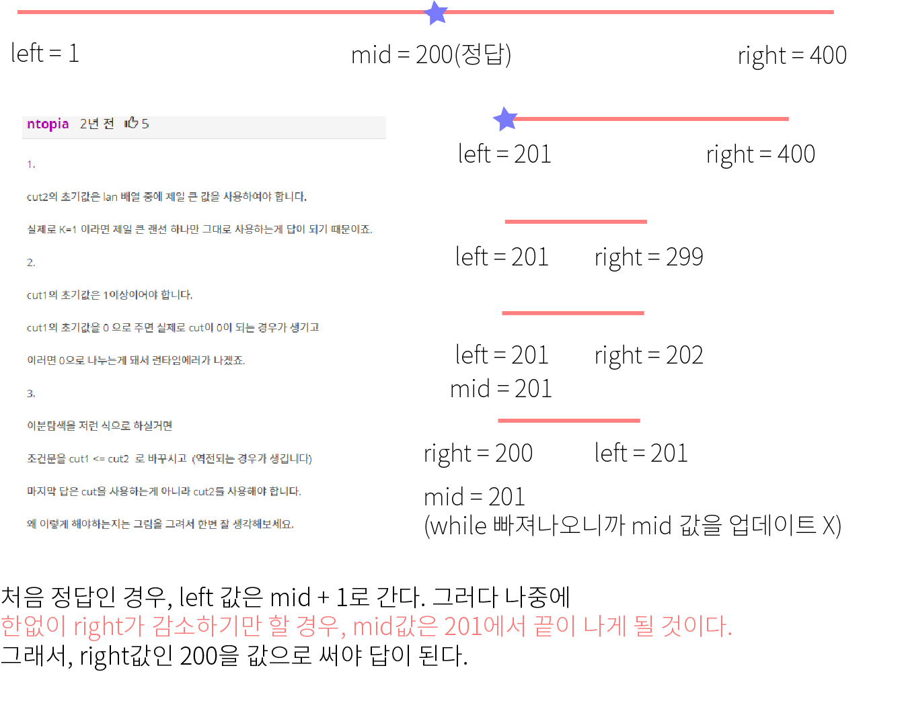

 ## 알고리즘 - 랜선 자르기

  - 길이를 기준으로 srt, fin 값을 결정짓는다.

  - 길이는 반드시 1 이상이여야 한다. 아니면 mid 값이 0이 되어 divide 0 발생 = Runtime 조심!

  -  참고

  - 해당 조건을 만족할 시, max or min을 취해거나, 정확히 맞는 경우만 따로 코드를 짠다던가 해야할듯.

  
  ## 알고리즘 - A → B

   - 특정 숫자를 두 가지 경로( 곱하기 or 자리수 더하기)를 통해 특정 숫자로 보내려면 몇 번의 연산이 최소로 필요하냐는 문제이다.

   - 만약 곱하기는 2번의 연산이, 자리수 더하는 것은 한 번의 연산이 들어간다고 하면 다익스트라를 쓰는 것이 맞지만, 그렇지 않다면 일반 bfs를 썼어도 됬다.

   - 특이한 점은 check 배열을 쓰는 대신 set을 쓰는 것이였다. check배열은 쓰기에 자리수가 커서 overflow가 될 수 있기 때문.

   - 단순히 s.find(num) == s.end()) 라는 얘기는 원소를  못 찾았다는 얘기니까 이때만 값을 넣어주면 된다. 즉, (check[nx][ny] == 0)이랑 같은 얘기.

  ## 알고리즘 - 가장 긴 증가하는 수열(LIS)

   - 왜 LIS가 NlogN으로 풀리는지 알아야 한다.

   - 비교할 배열 (ary[n]과 vector<int> LIS)로 시작한다.

   - 배열의 각 원소를 순회하면서 ***원소 별 이분 탐색을 진행하는 시간(logN)이 합쳐져 nlogn이 되는 점을 기억해라.

   - lower_bound 함수는 원하는 k값 이상의 값이 처음으로 나오는 iterator를 반환한다.

   - 1. 일반적인 로직은 벡터의 끝값을 -INF로 만들어준다.

   - 2. 벡터의 끝값보다 ary[i]값이 크다면? => 벡터의 끝값에 ary[i] push!

   - 3. 그렇지 않다면 lower_bound(v.begin(), v.end(), ary[i])를 해서

       해당 자리에 push! *it = ary[i]!
    
   - 4. n번 순회 후 해당하는 v에는 LIS만 담겨있음을 기억하자!
   
  ## 20. 04. 23(목)

   - 작은 실천이 모여 큰 성공이 되는 날만 기다리며 '꾸준히' 달리자.

  