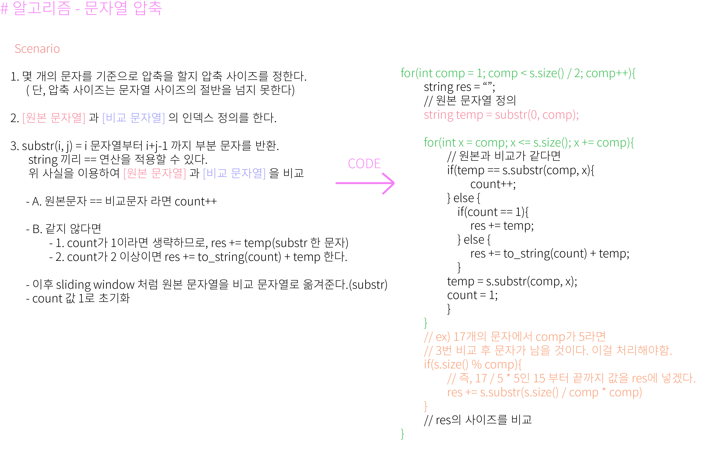

- 문자열 압축법에서 중요한 substr 함수에 대해 알아봤다.
- substr에서 인자를 하나만 주면 해당 인자를 포함한 공간부터 끝까지 반환
- 인자를 두개 줄 때 (ex : substr(j, i) 라면, j부터 j+i-1까지의 문자를 반환한다.

## 알고리즘 - 압축

 - 괄호를 통해 압축된 문자를 해제해 보는 문제

 - 괄호 안의 값을 해독하는 문제가 나온다면 가장 먼저 해야 할 것

    ```
    for(int i=0; i<s.length(); i++){
        if(s[i] == '('){
            // 왼괄호가 나오면 stack에 왼괄호의 위치값을 push.
            st.push(i)
        }
        else if(s[i] == ')'){
            // matching 배열임.
            // 왼괄호의 인덱스에 오른괄호의 위칫값을 넣어준다.
            matched[st.top()] = i;
            st.pop();
        }
    }
    ```


 - 재귀를 도는데 가장 쉬운 문제부터 스스로 만들고 디버깅 할 줄 알고, 그대로 해보면 될듯. 여기서 중요한 것은 함수를 만들 때, start 위치와 end 위칫값을 잘 정할 줄 알아야 한다.

 - 재귀를 돌고 나서, ***idx의 위치를 왼괄호의 짝인 오른괄호의 위치로 변경해 주는 테크닉*** 진짜진짜 중요

 ## 알고리즘 - 가사 검색

  - 선형 구조로 검색하면 절대 풀 수 없는 탐색 문제였다.

  - 빨리 탐색 할 수 있는 자료구조로 Trie 구조가 있다.

  - 이를 사용하면 단어의 최대 길이 M이라 할 때, O(M)에 검색 가능하다.

  - 단 이 문제는 변형한 구조로, 물음표(?)가 어디에 붙을 지, 몇개가 붙을 지 모르기 때문에
 
  - ***단어 개수 별 Trie 만들기, 접두사, 접미사 별 역방향 Trie 만들기***의 개념을 알고 있었어야 했다.

  - 외우기용 코드
  ```
  Struct Trie{
      Trie* next[26]; // 알파벳이면 26, 숫자면 10으로
      bool finish;

      Trie() : finish(false) {
          memset(next, 0, sizeof(next));
      }

      ~Trie() : {
          for(int i=0; i<26; i++){
              if(next[i]) delete next[i];
          }
      }

      void insert(const char* key){
          if(*key == '\0'){
              finish = true;
          }
          else{
            int curr = *key - '0';
            // 이부분 까먹지 말도록. 객체 생성 후 넣어야지
            if(next[curr] == NULL){
                next[curr] = new Trie();
            }
            next[curr]->insert(key+1);
          }
      }

      bool find(const char* key){
          if(*key == '\0')
            return 0;
          if(finish)
            return 1;
          int curr = *key - '0';
          return next[curr]->find(key+1);
      }
  }

  // 트라이 자료구조 생성법
    Trie* root[10001];
    Trie* rev[10001];
  ```

 - 이 구조를 사용하면 [전화번호 목록] 문제를 쉽게 풀 수 있다.


## 20. 04. 24(금)
 - 압축된 문자를 다시 해독하는 문제도 나올 수 있겠는데?
 - Trie 문제 정말 어렵다..