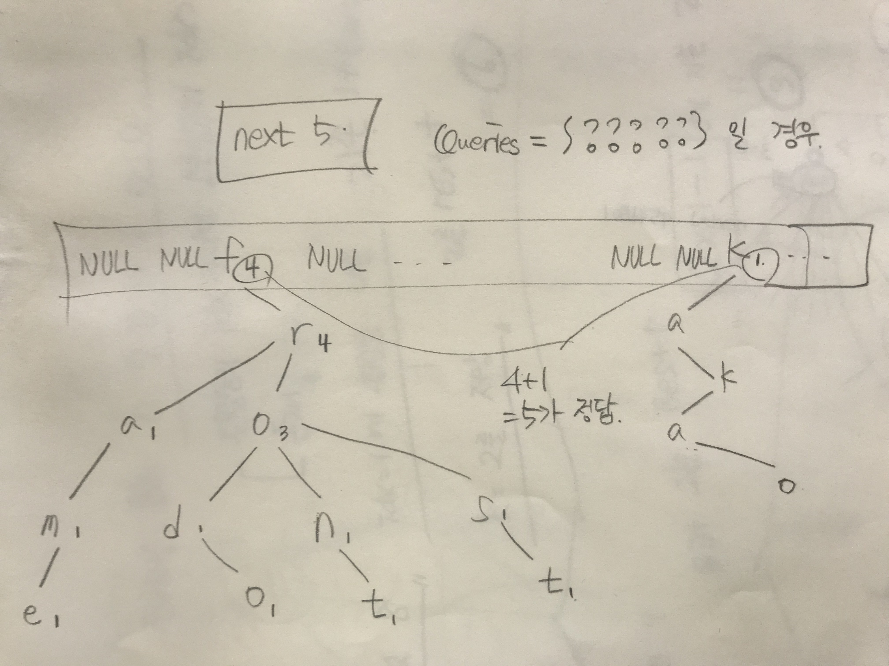

## 알고리즘 - 기둥과 보 설치

 1. 삽입, 삭제가 가능한 Object가 두개 이상 있고, 두 Object가 한 지점에 동시에 있을 수 있다면 3차원 배열로 맵을 생성하는 버릇 가지자

 2. 삭제하는 조건이 너무 많고 까다로워 선뜻 생각이 나지 않았다. 이때 할 수 있는 테크닉은, 먼저 삭제를 하고 전체 배열을 돌면서 기둥 or 보가 설치되어 있지만 삽입이 되지 않는다? 그럼 원래대로 기둥 or 보를 되돌려 놓는 방법이 있다.

 3. x, y 좌표계가 일반적인 배열과 다르다면 반드시 좌표계를 돌려서 생각하자. Test case 한개만 그려봐도 손쉽게 풀 수 있다.

 4. 여러개의 벡터 리스트가 존재할 때 우선순위 큐 대로 구현하는 cmp 함수 사용법 익혀라.

 ```
 bool cmp(vector<int> v1, vector<int> v2) {
	if (v1[0] == v2[0]) {
		if (v1[1] == v2[1]) {
			return v1[2] < v2[2];
		}
		return v1[1] < v2[1];
	}
	return v1[0] < v2[0];
}

sort(answer.begin(), answer.end(), cmp);
```

5. x-1이나 x+1 조건이 있는 문제에선 반드시 맵의 크기를 +2나 +3정도 늘려놓아라.


## 20. 04. 25(토)
 - Trie 자료구조를 이용하면 O(word_length) 만에 원하는 단어를 찾을 수 있고, 간단 응용법을 알아봤다.

 - 불안해하지말고 내가 가는 길이 맞다고 생각하자.

 - https://plzrun.tistory.com/entry/%EC%95%8C%EA%B3%A0%EB%A6%AC%EC%A6%98-%EB%AC%B8%EC%A0%9C%ED%92%80%EC%9D%B4PS-%EC%8B%9C%EC%9E%91%ED%95%98%EA%B8%B0

 - 아직 갈길은 멀고 너무 어렵지만 차근 차근.. 운동이랑 같다. 상처가 나야 성장한다 믿자