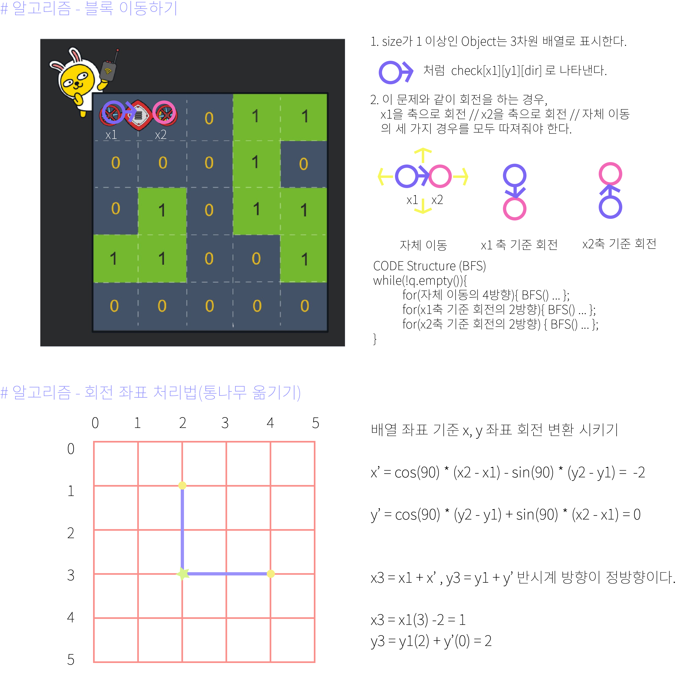

## 알고리즘 - 치즈

 - 1. 치즈 안에 있는 공기와 바깥 공기를 구분 할 수 있는가?

    = (0,0)부터 bfs 돌린 부분만 큐에 넣으면 구분 가능!

 - 2. 공기가 두번 닿는 곳만 제거가 된다는 조건을 구현할 수 있는가?

    = map이 1이면 check[nx][ny]++ 후, if(check==2)면 이때만
    
    = 제거하기, 단 if(check[nx][ny]==2) continue;는 꼭 넣어주기!

## 20. 04. 26(일)

 - 카카오 모의고사 중 요구하는 덕목이 무엇인지 보고 풀어보는 연습 ~~ 저녁엔 작년 인턴모의고사 문제 봐야지