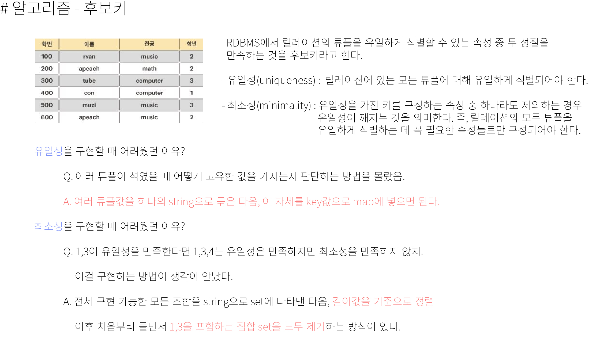

CODE
```
bool cmp(pair<int, double> I, pair<int, double> C) {
	if (I.second == C.second) {
		return I.first < C.first;
	}
	else return I.second > C.second;
}
vector<int> solution(int N, vector<int> stages) {
	vector<int> answer; vector<pair<int, double>> tmp;
	sort(stages.begin(), stages.end());
	
	for (int i = 0; i < stages.size(); i++) {
		temp[stages[i]]++;
	}

	int ssize = stages.size();
	double errrate = 0;
	for (int i = 1; i <= N; i++) {
		if (temp[i] == 0) {
			tmp.push_back({ i, 0 });
			continue;
		}
		int success = 0;
		for (int j = i; j <= stages.back(); j++) {
			if (temp[j] == 0) continue;
			success += temp[j];
		}
		if (success > 0) {
			errrate = (double)temp[i] / (double)success;
		}
		tmp.push_back({ i, errrate });
	}
	
	sort(tmp.begin(), tmp.end(), cmp);
	for (int i = 0; i < tmp.size(); i++) {
		answer.push_back(tmp[i].first);
	}
	return answer;
}
```



 - 후보키 어렵다. 삭제할때 idx 실수 일어날 수 있으니 조심..
 
## 20. 04. 28(화)
    - cmp 함수를 써서 문제를 풀어보는것.중요!
    - 저녁엔 후보키 문제 풀어보자!