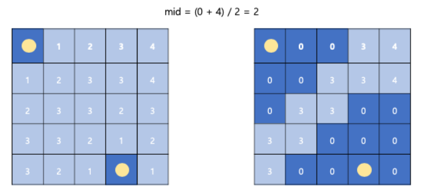

## 알고리즘 - 백조의 호수

 - bfs 적용하는 r, c가 1500이라는 점 => TLE

 - 기존의 풀이는 빙하를 제거 -> 만날 수 있는지 확인의 순서였다.

 - 최악의 경우 1500 * 1500 * (접점 여부 확인 1500*1500√2) = TLE.

 - 이를 해결하기 위해 BFS + 이분 탐색을 적용한다.

 - 1. 한번 bfs를 적용하여, 언제 녹는지 check 배열을 갱신한다.

  

  - (참조 : https://exponential-e.tistory.com/25)

 - 2. 이후, bfs로 퍼질 수 있는 조건을 mid값을 주어 이분탐색 실행

  - O(1500*1500*log(1500*1500)) = AC

  CODE
  ```
    #include<iostream>
    #include<vector>
    #include<string>
    #include<queue>
    #include<algorithm>

    using namespace std;
    int r, c, ans = 1e9;
    vector<vector<char>> map;
    vector<pair<int, int>> water;
    vector<pair<int, int>> whitebird;
    vector<vector<int>> check;
    int dx[4] = { -1, 0, 1, 0 };
    int dy[4] = { 0, 1, 0, -1 };
    int solve();
    void print();
    bool meeting(int mid);

    int main() {
        ios_base::sync_with_stdio(0); cin.tie(0);
        cin >> r >> c;
        map.resize(r);
        check.resize(r);
        for (int i = 0; i < r; i++) {
            string a; cin >> a;
            check[i].resize(c);
            for (int j = 0; j < a.size(); j++) {
                map[i].push_back(a[j]);
                if (a[j] == '.') {
                    water.push_back({ i,j });
                }
                if (a[j] == 'L') {
                    whitebird.push_back({ i, j });
                    water.push_back({ i, j });
                    map[i][j] = '.';
                }
            }
        }

        cout << solve() << '\n';
        return 0;
    }

    int solve() {
        bool isavail = false;
        int time = 0, right = 0;
        queue<pair<pair<int, int>, int>> q; // 물 전용 보관 큐
        
        for (int i = 0; i < r; i++) {
            for (int j = 0; j < c; j++) {
                check[i][j] = -1;
            }
        }
        // 얼음이 녹는 날짜 저장 완료
        for (int i = 0; i < water.size(); i++) {
            int u = water[i].first;
            int v = water[i].second;
            q.push({ { u, v }, 0 });
            check[u][v] = 0;
        }

        while (!q.empty()) {
            int x = q.front().first.first;
            int y = q.front().first.second;
            int dist = q.front().second;
            q.pop();
            for (int i = 0; i < 4; i++) {
                int nx = x + dx[i];
                int ny = y + dy[i];
                if (nx < 0 || nx >= r || ny < 0 || ny >= c || check[nx][ny] != -1) continue;
                if (map[nx][ny] == '.') {
                    check[nx][ny] = dist;
                    q.push({ { nx, ny }, dist });
                }
                if (map[nx][ny] == 'X') {
                    check[nx][ny] = dist + 1;
                    right = max(right, dist + 1);
                    q.push({ { nx, ny }, dist + 1 });
                }
            }
        }
        print();
        
        int left = 0;
        while (left <= right) {
            int mid = (left + right) / 2;
            bool isattach = meeting(mid);
            if (!isattach) {
                left = mid + 1;
            }
            else {
                ans = min(ans, mid);
                right = mid - 1;
            }
        }
        return ans;
    }

    bool meeting(int mid) {
        // 2차원 벡터 한방에 초기화
        vector<vector<bool>> ischeck(r, vector<bool>(c));
        queue<pair<int, int>> whiteq; // 백조가 퍼지는 공간 전용 큐
        
        whiteq.push({ whitebird[0].first, whitebird[0].second });
        ischeck[whitebird[0].first][whitebird[0].second] = true;

        while (!whiteq.empty()) {
            int x = whiteq.front().first;
            int y = whiteq.front().second;
            whiteq.pop();
            if (x == whitebird[1].first && y == whitebird[1].second) return true;
            for (int i = 0; i < 4; i++) {
                int nx = x + dx[i];
                int ny = y + dy[i];

                if (nx < 0 || nx >= r || ny < 0 || ny >= c || ischeck[nx][ny]) continue;
                if (check[nx][ny] <= mid) {
                    ischeck[nx][ny] = true;
                    whiteq.push({ nx,ny });
                }
            }
        }
        return false;
    }
  ```

## 20. 05. 02(토)

 - 이전 로봇 청소기와 비슷한 논리(bfs + MST Table로 인한 dfs 탐색)

 - 이번건 (bfs + 이분 탐색) 신기방기.. 이 원리는 w, h값이 큰 경우.