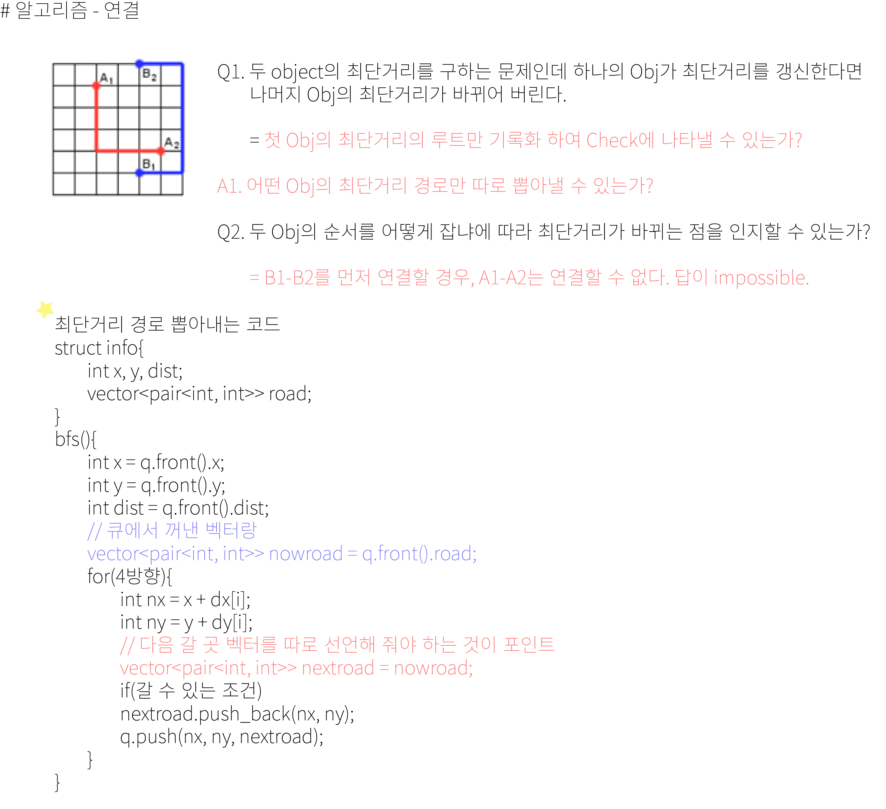

## 알고리즘 - 열혈강호

 - 이분 매칭의 가장 기본적인 형태

 - 사람 번호, 일의 번호가 주어질 때 1:1 매칭이 최대한 가능하도록
   하는 알고리즘, Basic은 dfs 기반.

 ```
 for(사람 수){
     memset(check);
     if(dfs(i)) answer++;
 }

 int dfs(int now){
     if(check[now]) return 0;
     check[now] = 1;
     for(next : adjList){
         int next = adjList[i];
        if(!match[next] || dfs(match[next])){
            match[next] = now;
            return 1;
        }
     }
     return 0;
 }
 ```
 - 이분 매칭이란? : 이분 그래프에서 A 그룹의 정점에서 B 그룹의 정점으로 간선을 연결 할 때, A그래프의 하나의 정점이 B그래프 하나의 정점만 가지도록 구성된 것이다.

 ## 20. 05. 05(화)
  - bfs 이후 경로값만 따로 뽑아오는 테크닉 진짜 좋은 문제였다.
  - 세그먼트 트리, 그리디 등등 부족하다 싶은건 알아서 배우자.
