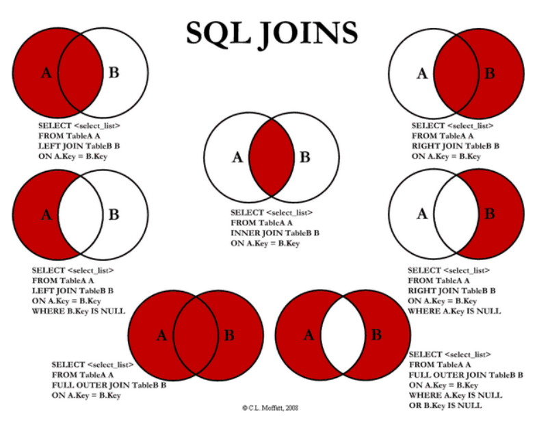
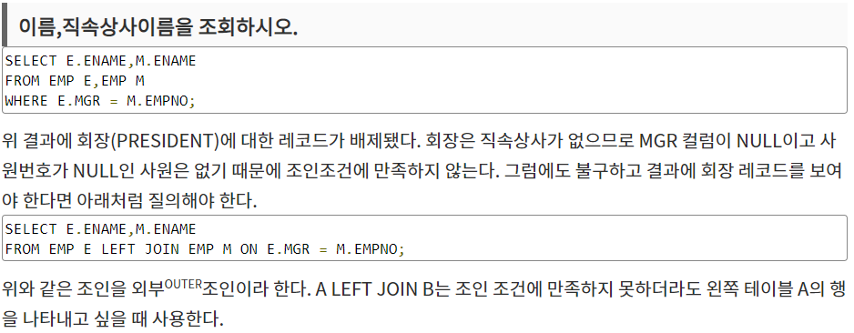
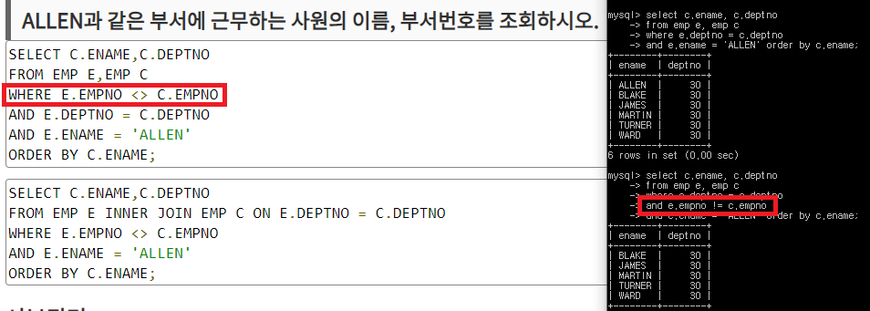
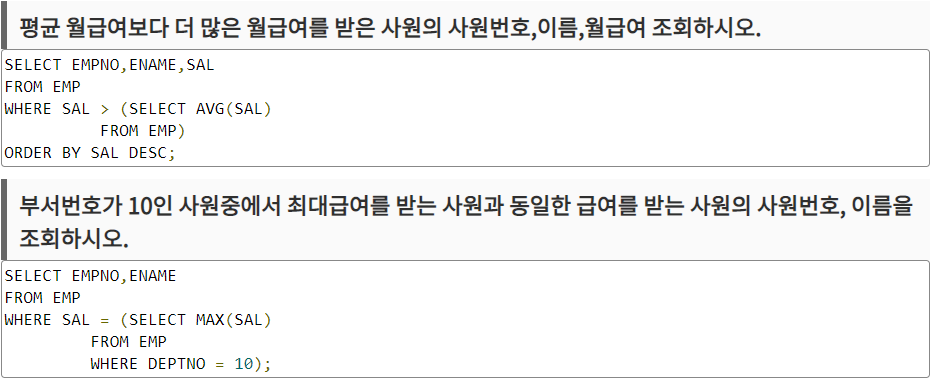

## SQL 문제

 1. select hour(datetime)을 입력하면 시간만 나온다.

 2. 입양 시각 구하기(2)는, 실제 데이터에 없는 시간까지도 나오게 하는 것이 핵심인데,

    ```
    select h1.hour, ifnull(outs.count, 0) as count
    from (
    select 0 as hour
    union select 1 union select 2 union select 3 union select 4
    union select 5 union select 6 union select 7 union select 8
    union select 9 union select 10 union select 11 union select 12
    union select 13 union select 14 union select 15 union select 16
    union select 17 union select 18 union select 19 union select 20
    union select 21 union select 22 union select 23 ) h1
    left join (
    select hour(datetime) as 'hour', count(*) as 'count'
    from animal_outs
    group by hour) as outs on h1.hour = outs.hour;
    ```
    + left join (테이블) on (조인 조건)의 기본 형식에서 테이블 = subquery로 나타낼 수 있다는 점.

    + ifnull(a, b)는 a값이 존재하면 a를 쓰고 없다면 b를 사용함.

    + 위와 같이 'union select n' 시에 쿼리 안에 사용자가 설정한 테이블이 만들어진다.


3. 0과 null은 다르지만, null을 확인할 땐 where a is (not) null;과 같이 사용한다.

    - SELECT animal_type, ifnull(name, 'No name'), sex_upon_intake from animal_ins;

4. 외래키란, 다른 테이블 입장에서 기본키가 되는 키다.
    ```
    create table A(
        ...
        order_id INTEGER,
        primary key (pid),
        foreign key (c_id) references B(cc)
    );
    create table B(
        primary key (cc),
        ...
    );
    alter table b
        add foreign key (c_id) references B(cc);
    ```

5. full outer join 사용법
 - 그림에서 보듯 inner join과 outer join(left, right join)의 차이는 공통 요소만 뽑으면 inner join, 아니면 outer join 명심!
 - select <column_list> from A full outer join B on A.key = B.key;
 - select <column_list> from A full outer join B on A.key = B.key
   where A.key is null or B.key is null;
   ;

6. 가장 오래 + n개 뽑아라는
 - order by (column_list) limit n으로 표현할 수 있다.

7. 특정 여러개의 String을 찾아야 할 땐 a.name in ('A', 'B', ...)로 표현할 수 있다.

8. 특정 문자가 들어간다면 name like '%ch%'로 표현 가능.

9. select 구문에 case ~ when ~ then ~ end 구문 사용법.
    ```
    SELECT animal_id, name,
    case
    when sex_upon_intake like '%Neutered%' or sex_upon_intake like '%Spayed%'
    then 'O'
    else 'X'
    end as '중성화'
    from animal_ins;
    ```
10. 중복된 요소를 하나로 치느냐 마느냐 중요하게 따져봐라.
  - SELECT count(distinct name) from animal_ins; (중복 요소 하나로 칠 때) - 96
  - SELECT count(name) from animal_ins; - 99

11. 정렬의 우선순위를 해야 할 때
  - SELECT animal_id, name, datetime from animal_ins order by name asc, datetime desc;

12. 서브쿼리 사용법
  - SELECT name from animal_ins where datetime = (select min(datetime) from animal_ins);
  - 보통 정렬 후 limit 걸어도 되는데 그냥 해봄

13. 조인할때 inner join 해야할지 outer join 해야할지, catersian product 해야할지 잘 판단해보길.
  - 판단 기준은 테이블 요소들이 null 값을 포함하느냐 마느냐 여부니까.
  

14. 특정 직원과 같은 부서에 일 하는 사람의 정보를 뽑아라는 쿼리가 들어오면
 - 일단 where 조건을 다는 데 중요한점은 자기 자신은 빼야 함. 중요중요!
  

15. 서브쿼리 사용 예
 - 


## 20. 06. 05(금)
 - 내가 아는대로 최대한 쳐보자~ 좋은 기회네

