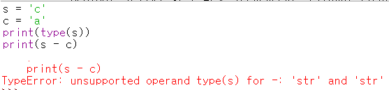

## 알고리즘 - 가장 많은 글자(Python)

 1. 한 줄 입력
    + r = sys.stdin.readline()
 
 2. 없으면 그만 받기
    + if not(r): break

 3. C++의 배열 == Python의 리스트이고 정적 공간 할당법
    + ary = [0]*26

 4. 파이썬에서 받은 문자를 아스키 코드로 치환하는 함수
    + ord(문자열)
    + chr(아스키코드) => 문자열
    + ex) r[ord(c)-97] += 1
    * 이렇게 하면 에러남(C++)
      

 5. list comprehension과 비슷한 출력 코드
    + print(chr(i+97) if r[i]==max(r) else '', end='')
    + list의 max(list name) = 해당 list의 최대값을 반환

 6. 숫자 두개를 한번에 받아 int로 저장하기
    + n, m = map(int, input().split())

 7. 파이썬에서도 set을 사용할 수 있다.
    + set.add()
    + set에 있는지 확인 : for i in set:
    + 하지만 list는 append를 사용
    + list는 sort()로 쉽게, sort(reverse=True)로 내림차순 설정

 8. list reverse
    + r = v[::-1]

## 알고리즘 - 팰린드롬 만들기(Python)
 - 팰린드롬을 만들기 위한 최소 문자 수를 찾아라.
 - 투 포인터 알고리즘 마냥
  ```
  v = sys.stdin.readline().rstrip()
  for i in range(len(v)):
    r = v[i:]
    left = 0
    right = len(r) - 1
    isPal = True
    while left <= right:
        if r[left] != r[right]:
            isPal = False
            break
        left += 1
        right -= 1
    if isPal is True:
        print(len(r) + 2*i)
        break
  ```
 - readline에서 rstrip을 해주지 않으면 공백문자도 들어간다. 조심.

 ## 20. 06. 11(목)
  - 파이썬 공부중.. 확실히 편해
