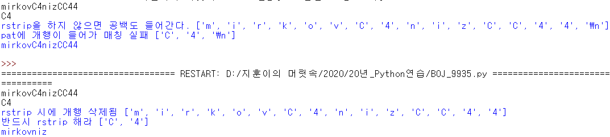

## 알고리즘 - 그룹 단어 체커(Python)

 - 핀셋이 전체 길이를 순회하면서 한 칸 앞 문자가 같다면 문자가 서로 다를때까지 밀어준 후, set에 존재 여부를 통해 판단했다.

 - 문자열 처리 시 중요한 점은, pin == pin+1을 할 일이 굉장히 많으며
 - 반드시 pin+1이 끝 인덱스 포함 하는지 아닌지 면밀히 체킹해 줘야 한다.

```
import sys

n = int(input())
ans = 0
for i in range(n):
    s = sys.stdin.readline().rstrip()
    pin = 0
    d = set()
    isok = True
    
    while pin < len(s):
        // if(pin+1 < len(s) - 1)로 넣을 시, ahh가 0이 나오는 반례
        // 그니까 끝 범위 체킹 면밀히 하자구
        if pin+1 < len(s):
            while s[pin] == s[pin+1]:
                pin += 1
                if pin+1 >= len(s): break
            if s[pin] in d:
                isok = False
                break
            else:
                d.add(s[pin])
        else:
            if s[pin] in d:
                isok = False
                break
        pin += 1
    if isok is True:
        ans+=1
                
print(ans)
```

 - rstrip을 쓰지 않을 시 발생하는 개행 추가
 

## 20. 06. 13(토)
 - 더더더 코테 다 부술거다