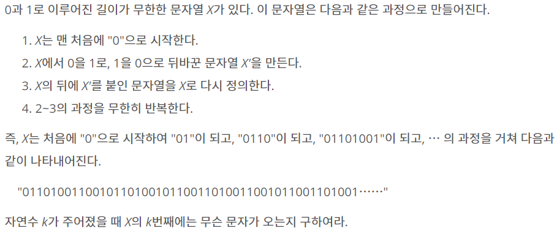
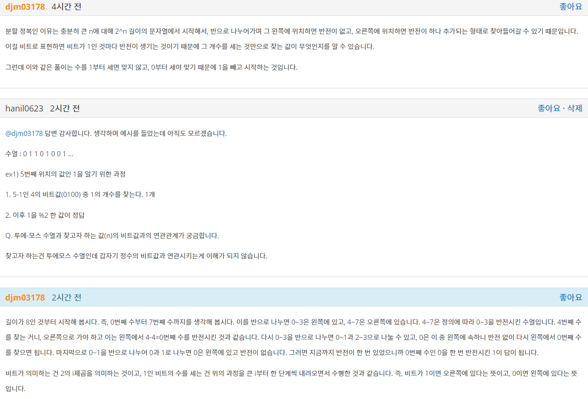

## 알고리즘 - 종이의 개수(C++, 분할정복)
 
 - 잘린 종이에 대해 특정 행동을 반복하는 행위를 구현할 수 있는가?
    + 건포도 문제에서 익힌 것과 비슷하다.(재귀)
    + 자르는 행위는 반드시 인자가 4개 들어간다. (시작x, 시작y, 끝x, 끝y)
 - 자르는 행위에 대한 감각 = 분할정복(Top-down) 방식임을 알 수 있는 기회

 CODE
 ```
 void solution(int sx, int sy, int ex, int ey) {
	int pivot = map[sx][sy];
	int width = ey - sy;
	int height = ex - sx;
	bool isok = true;
	if (width == 0 || height == 0) return;
	for (int i = sx; i < ex; i++) {
		if (!isok) break;
		for (int j = sy; j < ey; j++) {
			if (pivot != map[i][j]) {
				isok = false; break;
			}
		}
	}
	if (!isok) {
		solution(sx, sy, sx + width / 3, sy + width / 3);
		solution(sx + width/3, sy, sx + (width / 3)*2, sy + width / 3);
		solution(sx + (width/3)*2, sy, sx + width, sy + width / 3);

		solution(sx, sy + width/3, sx + width / 3, sy + (width / 3)*2);
		solution(sx + width / 3, sy + width / 3, sx + (width / 3) * 2, sy + (width / 3)*2);
		solution(sx + (width / 3) * 2, sy + width / 3, sx + width, sy + (width / 3)*2);

		solution(sx, sy + (width / 3)*2, sx + width / 3, sy + width);
		solution(sx + width / 3, sy + (width / 3)*2, sx + (width / 3) * 2, sy + width);
		solution(sx + (width / 3) * 2, sy + (width / 3)*2, sx + width, sy + width);
	}
	else {
		if (pivot == -1) _minus++;
		else if (pivot == 0) _zero++;
		else _plus++;
	}
}
```

## 알고리즘 - 투에-모스 수열

 

 > 핵심은 특정 조건의 수열이 주어지고, 조건에 맞는 수열 항을 찾는 것
   1. 수열의 항은 ***이전 항의 크기 x2***
   2. 다음 항은 ***이전 항의 값을 반전***시켜 뒤에 넣음
    
 - 비트마스크에서 정수 n의 bit 연산결과가 어떤 것을 의미하는지 파악할 줄 아는 연습

 

 - 만약 13번째 투에모스 수열의 값을 물었을때 0번째 ~ 12번째 수열이라 생각하자.
 - 12는 bit로 1100이다. 각 비트는 2^n <= x < 2^n+1 에 있는 자리라 생각하면
 - 처음 1은 8 ~ 15번째 자리다. 이 의미는 12번째 수열은 투에-모스에서 오른쪽에 있다는 의미이다. 즉, 4번째 수열을 반전(^)했단 의미와 같다. 
 - 4번째 수열은 다음 비트인 1에서도 (0 ~ 7) 중 오른쪽에 위치한다. 그러므로 4번째 수열은 0번째 수열의 값을 반전시킨 것과 같다. 
 - 0번째 수열은 왼쪽에 있고, 1100 중 값이 0이다. 그러므로 반전하지 않는다. 이 말은, k-1의 bit 연산 중 1의 개수를 찾고, 0번째 수열의 값을 그만큼 반전시키면 된다는 의미이다. 
 - 0을 홀수번 반전시키면 1이 나오고, 짝수번 반전시키면 0이 나오므로 % 2한 값이 답이 되는 원리이다.

 ## 문자열 파싱 코드(Python)

  > ex) str = '"5", "Brown", "Accountant"'와 같이 주어질 때, 이를 파싱하기 위한 코드
  
  ```
  st = sys.stdin.readline().rstrip()
  # 먼저 콤마(',')를 split 한다. 문자열->리스트
  t1 = st.split(',')
  
  # strip에 들어오는 문자로 이루어지는 조합을 싹다 없앤다.
  # 띄어쓰기(' ')와 쌍따옴표(' " ')를 같이 적어주면 쉽게 파싱가능!!
  for i, j in enumerate(t1):
	t1[i] = j.strip(' \"')
  # ['5', 'Brown', 'Accountant']	
  print(t1)	
  ```

  ```
  t1 = [[]*3]*3
  t2 = []

  for k in range(n):
    st = sys.stdin.readline().rstrip()
    t1[k] = st.split(',')
    for i, j in enumerate(t1[k]):
        t1[k][i] = j.strip(' \"')
  print(t1)
  ```

## Left Join 구현(Python)
 
 ```
 import sys
 n, m = map(int, input().split())

 t1 = [[]*3]*3
 t2 = [[]*3]*3
 dic = {}
 for k in range(n):
    st = sys.stdin.readline().rstrip()
    t1[k] = st.split(',')
    for i, j in enumerate(t1[k]):
        t1[k][i] = j.strip(' \"')
    if t1[k][0] not in dic:
        dic[t1[k][0]] = set(t1[k][1:])

 for k in range(m):
    st = sys.stdin.readline().rstrip()
    t2[k] = st.split(',')
    for i, j in enumerate(t2[k]):
        t2[k][i] = j.strip(' \"')
    if t2[k][0] in dic:
        dic[t2[k][0]].update(dic[t2[k][0]] | set(t2[k][1:]))
        #dic[t2[k][0]].union(set(t2[k][1:]))
    else:
        dic[t2[k][0]] = set(t2[k][1:])
 print(sotred(dic.items())
 ```

 ## 20. 06. 15 (월)
 - 투에-모스 때문에 한참을 헤맸다. 하지만 좋은 경험이다. 분할정복, 그리디, dp 경험 더 키워야 함.

 - c++의 map은 python의 dict와 같다. 많이 써보자. 강력함
