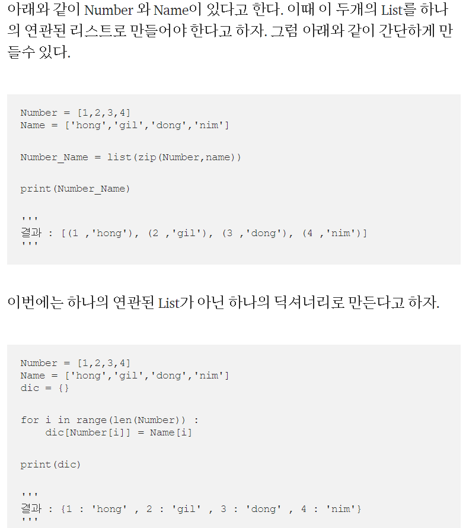
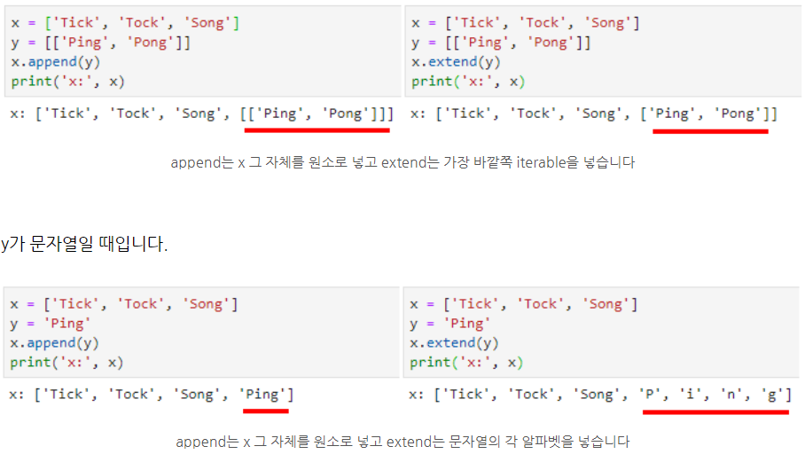

## 알고리즘 - 안전 영역(Python)

 - 파이썬으로 bfs를 사용하며 느낀 테크닉

 1. 이차원 배열 동적할당법
    - map = [[0]*(가로길이) for _ in range(세로길이+1)]

 2. C++의 큐는 파이썬에서 list로 해결가능하다.
    - 큐의 LIFO 구조는 q.pop(0)으로 가능하며, 반환이 자동으로 된다.
    - pop 시에 뒤 자료들은 자동으로 당겨진다.

 3. 큐에 넣을 땐 list로 넣을 수 있다 [x, y]
    - q.append([nx, ny])

 4. 깨알 zip 함수는 같은 길이의 두개의 리스트를 tuple로 묶어주는 역할을 한다.

    - for i, j in zip(list1, list2)
    - i와 j는 각각 list1과 list2의 iterator이다.
    
 
 5. 함수는 반드시 제일 위에 선언하자.

 6. list.append와 extend의 차이
    

## 20. 06. 23(수)
 - 생일이라고 챙겨주는 사람들이 생각보다 많았음을 느낀 하루
 - 인간관계 잘 해놨네 계속 정진하자 gogo 감사합니다ㅏ 

 
