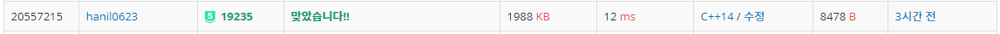

## 알고리즘 - 문자열 압축(Python)

 > [압축] 키워드가 나올 때 이용할 수 있는 방법
    
    1. Stack 이용(괄호와 같이 짝 개념이 등장하면 좋다)

    2. 재귀 이용(괄호가 나올 때, 왼괄호와 오른괄호의 위치를 묶은 match 배열 사용)

    3. Pointer 사용 (while)


   ###### ※ 주의점

   1. 압축은 문자를 줄이는 과정이므로, 'a'와 같이 **압축할 문자가 없을 때 예외처리** 반드시 해야 한다.

   2. 인덱스를 이동시키는 과정이므로 **비교할 문자열이 더이상 없을때 예외처리**
    + 이땐 코드가 길어지더라도 했던 과정 또 해도 된다. 단 인덱스 주의

## 알고리즘 - 모노미노도미노(C++)

 - 며칠간 개고생 후 드디어 풀었다.!
 

 ###### 느낀점

 1. object를 옮길 때는 보통 for문으로 다 돌린다.

    ```
    for(i){
        for(j){
            // 검사 도중 Obj 발견 or 범위 초과
            break;
        }
        // Object 추가하기
        // 단, flag 변수를 사용하지 않기 위해선 반드시 i,j는 지역으로 선언후 사용
        // for(int i=0 금지!)
    }

    // 모범 코드(Object move)
    void go(int z, int type, int y) {
        int i, j, k;
        if (type == 1) {
            for (i = 0; i < 6; i++) {
                if (a[z][i][y] != 0)break;
            }
            a[z][i - 1][y] = bid;
        }
        else if (type == 2) {
            for (i = 0; i < 6; i++) {
                if (a[z][i][y] != 0 || a[z][i][y + 1] != 0) break;
            }
            a[z][i - 1][y] = bid;
            a[z][i - 1][y + 1] = bid;
        }
        else {
            for (i = 1; i < 6; i++) {
                if (a[z][i][y] != 0) break;
            }
            a[z][i - 1][y] = bid;
            a[z][i - 2][y] = bid;
        }
    }
    ```
2. 이 경우는 대칭이 보이는데도 불구하고 틀릴까봐 함부로 쓸 수 없던 문제였다. 하지만 어떻게든 써 보려고 하자. 코드가 간단해진다. + 대칭 = 차원을 추가하자. 3차원배열로

3. Obj가 커서 for문으로 옮기기 뭐할때는 (cluster object) **반드시 tmp 배열에 옮긴 후 for문 끝나면 다시 옮기는 습관** 들여라. 진짜진짜 자주나오고 중요한 기법이다.

4. 이 문제의 핵심 포인트는 테트리스 시에 윗라인의 Object 중, 블럭과 타일을 구분하여 움직일 줄 알아야 했었다.
 - for문을 돌면서 4방향의 Obj number가 나와 같다면 블럭, 없으면 타일로 생각하고 움직였다.

 괜찮은 코드

 ```
 if (j < 3 && a[z][i][j + 1] == a[z][i][j]) {
    for (k = i; k < 6; k++) {
        if (tmp[k][j] != 0 || tmp[k][j + 1] != 0)
            break;
    }
    tmp[k - 1][j] = a[z][i][j];
    tmp[k - 1][j + 1] = a[z][i][j];
 }
 ```

## 20. 06. 27(토)

 - 파이썬이 문자열 처리는 진짜 강력하다.
 - 풀었던 내용이라도 다시 보고, 키워드 별 예외상황, 해결법 기억하자