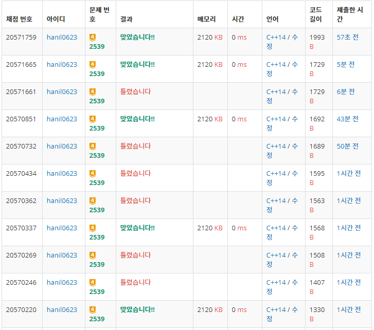

## 알고리즘 - 모자이크(C++)

 1. 색종이를 덮는다는 표현을 ~~map[x][y] = 0으로 표현할 수 없게 만든 문제(n,m이 백만)~~

    - 이땐 현재 덮고 있는 색종이의 위치를 변수로 만들어 관리하는 방법을 사용하자.

 2. 이분탐색 시 아주아주 중요한 실수, 미묘한 실수

    - 이분탐색 전 반드시 **정렬** 하자.
    - L,R 설정 시, **L은 절대 0이 될 수 없다**.
    - 중간값 m이 찾고자 하는 값과 같은 경우를 처리하는 Logic과 반대되는 값을 리턴으로 하자.

    Example CODE
    ```
    while (L <= R) {
		m = (L + R) / 2;
        
		if (f(m)) {
            // m이 같은 경우 R을 조작하므로, 리턴은 반드시 L을 해야 한다.
            // 역전되는 경우 -1 차이로 값이 miss 날 수 있기 때문.
			R = m-1;
		}
		else {
			L = m + 1;
		}
	}
	return L;
    ```
    - 한참 헤맨 흔적들
    

## 20. 06. 28(일)

 - 아 별거 아닌걸 가지고 왜이리 헤맸는지. 이렇게 사소한 실수 하나가 사람 잡는다~