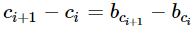
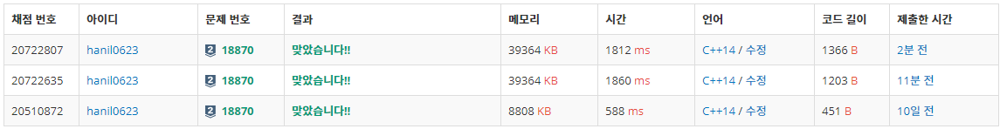

## 알고리즘 - Journey Planning (CF #625)

 - 수열 + 특정조건에서의 최댓값을 구하는 문제

 - ###### To do

    

    > 특정 수식을 항을 옮겨보며 변형 해볼 생각 하자.

    - **b(i+1) - c(i+1) = b(i) - c(i)**가 나온다. 즉, 위 식을 만족하기 위해서는 [원소 - 인덱스] 값이 같아야만 한다는 생각이 들게 됨.

    - 이를 응용하여 a[i] = j, (원소-인덱스가 i이 나오는 원소들의 합은 j다)고 생각하게 되고, 이 a배열의 합을 구하면 답이 된다.

    > 이런 경우 반드시 수열을 연습장에 적으며 생각하는 버릇 가지자.

    - 규칙이라는 것은 단순히 눈으로 보고 판단하기 어렵다. 또, **답이 되는 애들의 특정한 규칙이 있는지 확인**하는 작업!

    + 배열을 새로 정의하는 테크닉

    + 마이너스 연산을 할 때 나올 수 있는 최대범위를 생각하는 버릇 가지기

      - 여기선 최대 원소(1 ~ 40만) - 인덱스(1 ~ 20만)이므로, 원소가 1이고 인덱스가 20만이면 안되니 +20만 해주는 센스. 반대로 원소가 40만 인덱스 1, 덧셈 20만이면 a배열의 범위는 최대 60만이 된다.

      - 원소를 더하므로 최대 40만의 원소가 20만번 곱해질 수 있다. 그러면 범위는 int 넘어가므로 long long을 선언하는 센스 역시!

CODE
```
long long b[MAX];
long long a[600005];
long long res = -1;
int main() {
	ios_base::sync_with_stdio(0); cin.tie(0);
	int n; cin >> n;
	for (int i = 1; i <= n; i++) cin >> b[i];
	for (int i = 1; i <= n; i++) {
		a[b[i] - i + 200000] += b[i];
	}
	// 원소 - idx값은 0이 될수있으니 0부터 시작해야지.
	for (int i = 0; i <= 600000; i++) res = max(res, a[i]);
	cout << res;
	return 0;
}
```

## 알고리즘 - Magical Calendar (CF #654)

 - 중요한건 **답과 성질 찾기** 라는 점. **인풋과 답과의 연관관계만 생각**

 - 반드시 규칙을 그려봐야 한다는 점. n <= r 일때와 아닐때 어떤식으로 답이 나오는지 판정하는 문제. 즉, 인풋이 두개가 나오면 클때와 작을때로 나눠 생각하는 버릇 들여야 한다.

 - 일단 n이나 r값이 변함에 따라 답의 개수와 연관이 있지 않을까? 생각하기.

 CODE
 ```
 	long long t, n, r; cin >> t;
	while (t--) {
		cin >> n >> r;
		if (n <= r) {
			cout << (n * (n - 1) / 2)+1 << '\n';
		}
		else {
			cout << r * (r + 1) / 2 << '\n';
		}
	}
```

## 알고리즘 - Restoring Permutation (CF #623)

 - 이 문제를 풀라고 하면 못풀듯. 하지만 중요한 테크닉 정돈 가져가보자.

 1. 원본 배열인 b[i]를 받고 a[2*i-1] = b[i]와 같이 재배치 시키는 테크닉

 2. 어떤 숫자인 b[i]가 인덱스가 되는 마법을 자주 부릴 줄 알아야 한다.

    - c[b[i]] = 1와 같이 어떤 수의 증감은 배열 인덱스화 해서 쉽게 나타낼 수 있는 것 같다.

 3. for문에 특별한 범위를 넣는 경우 (for j = b[i]+1; j<=2*i; j++) 와 같이 이때는 **b[i]+1이 2*i를 넘어가는 경우가 있을 수 있음을 반드시 인지하고, 이때 예외처리를 해줘야 한다는 점**!!

## 그 외 꿀팁

 1. 해시값을 사용하는 Modular 선언 시, (1<<33) == overflow.
    - 그래서 long long으로 선언하는 편이다. const ll D = (1ll << 40);
 
 2. 모듈러값을 크게 하는 이유는 곱셈연산 같은 경우가 없으니 안심하고 사용해도 되는 케이스일때 쓴다.

	- 가령, 2^50인데 해시값 구할때 2^50 * 2^50을 해버리면 넘어가니까 위험. 한번에 곱해주는 값이 작다면 크게 잡아도 된다.

	- Default Modular : 1e9 + 7, 2^31보다 작으면서 충분히 큰 녀석을 선택. 가능하면 큰 값으로 해라.

	- 구간 성분같은 경우, 모듈러를 작은녀석으로 하면 해시충돌나는 Case

 3. **set을 사용할 수 없을때, 벡터 선언 후 값 대입 → sort → lower_bound로 대신 할 수 있다.**

 4. 해시값 만들때는 **내림차순**으로 만들자. 오름차순은 살짝 위험하다.

## 알고리즘 - lower_bound 구현(좌표 압축)

 - lower_bound와 이분탐색 코드의 차이 한번 짚고 넘어가자.
 - lower_bound는 찾고자 하는 값보다 큰 값이 나오는 최초의 지점이므로 찾는 값이 없어도 가장 근접한 큰 값의 위치를 반환해준다.

 CODE(lower_bound)
 ```
 int lb(int val) {
	int l = 0, r = 10;

	// 1. lb는 같은 경우를 포함하지 않음
	while (l < r) {
		int mid = (l + r) / 2;
		
		if (ary[mid] < val) {
			l = mid + 1;
		}
		else {
			//2. 아닌 경우(같은걸 포함) mid값을 그대로 넣는다.
			r = mid;
		}
	}
	// 3. 리턴값을 r로 한다.
	return r;
}
```

CODE(binary search)
```
while (L <= R) {
	m = (L + R) / 2;
    
	if (f(m)) {
        // m이 같은 경우 R을 조작하므로, 리턴은 반드시 L을 해야 한다.
        // 역전되는 경우 -1 차이로 값이 miss 날 수 있기 때문.
		R = m-1;
	}
	else {
		L = m + 1;
	}
}
return L;
```

###### 좌표 압축 시 나아갈점

 - Q. set을 lower_bound로 구현해 보려니 쉽지 않음.
 - medium of three 써도 별 차이 안나는데?
 - std::unique랑 set이랑 속도차이 심하게 나네?
 


## 20. 07. 05 (일)

  - 아 어렵다 할거 너무 많다.

  1. lower_bound No STL 사용하여 구현해 보는 연습(완료)

  2. 산책로 문제 반드시 풀어봐라.(hard)

  3. Trie 역시 이차원 배열로 구현하는 연습 해보자
	- 전화번호 검색, 가사 검색 새로 풀어보기

  4. 연결리스트
    - 일차원 배열 두개로 연결리스트 구현
	- https://blog.encrypted.gg/932?category=773649

  

    