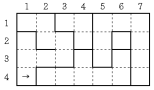

## 알고리즘 - 성곽
 
 1. 벽 유무를 판단하는데 비트마스킹 기법을 사용한다는것.
    - if(map[x][y] & (1 << k))

 

 2. 하나의 벽을 제거할 때 얻을 수 있는 가장 큰 방의 크기

  - 영역 문제에서 항상 고려해야 할 포인트는 두가지다.
    + 영역 처리를 전처리(bfs) 후, 갈 수 있는데 영역(check)이 다른 경우 체킹
      - 전처리에서 구한 영역을 나중에 합치기만 하면 된다는 생각!!

    + union_find인가? 고려해보기

## 알고리즘 - 탈옥

 - 이게 왜 다익스트라로 풀어야 하는지 한번더 생각해보고
 - 두명의 죄수가 한번에 탈출하는 특별한 경우이므로 다시 연구하자..
 - 플레기답네

## 20. 07. 17(금)
 - 과제 해야한다.