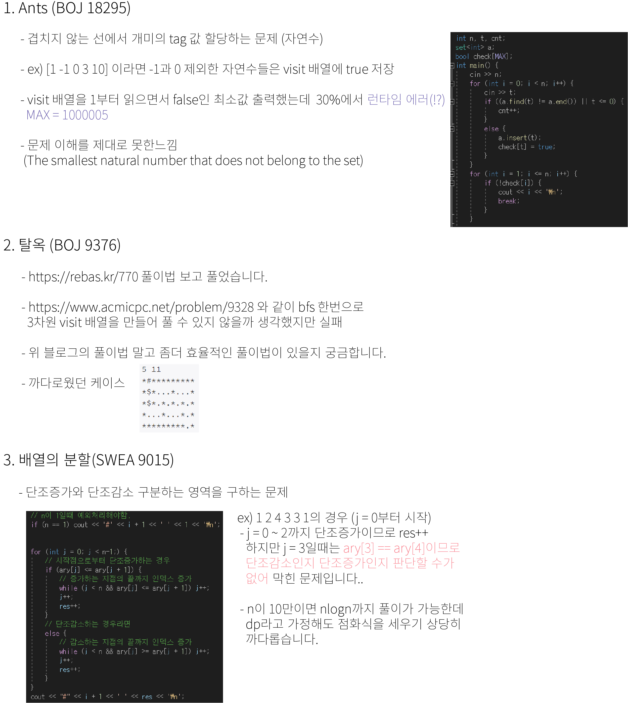

## 알고리즘 - Ants

 - mex 함수라는 개념이 따로 있나보다.

 > mex(minimum excluded) : 어떤 음이 아닌 정수의 집합이 주어졌을 때, 주어진 집합에 속해 있지 않은 수 중에서 최소값인 수를 나타낸다.
 
 mex([1,2,3]) = 4, mex([5,3,1,1,4]) = 2, mex([1,5,2,1,5,2,1,2]) = 3

 - 100 digits = 100자리 수이며 long long으로도 표현할 수 없다. 그래서 string으로 받는 습관을 가져야한다.

 - string의 각 문자들을 숫자로 바꿔주는 테크닉

 ```
 k = 0;
 for(auto x : s) k = 10 * k + x - '0';
 ```



 ## 20. 07. 18(토)
  - 아 넘넘 어려운데?!?

