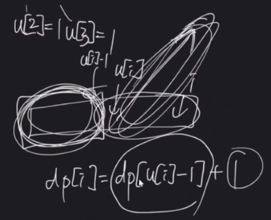

## 알고리즘 - 배열의 분할

 - 어떤 배열 성분을 쪼개는 행위를 할 수 있는가?

 - 이 문제의 어려운 점은 단조 증가와 단조 감소 구간을 구분하기 힘들다는 것이다.

 + **u[i] : 단조감소하는 최소 지점, d[i] : 단조증가하는 최소 지점**

 + 모르겠으면 전처리 해보는 습관을 가져라.

 + 와 같이 해당 특징이 적용되는 구간을 나눌 줄 아는 버릇 가져야한다.

 - for문 i 안에서 j라는 변수를 가져와 요리한 후, j의 값 이후로 i를 조정하는 마법의 코드

 ```
 // i는 j+1씩 바꾸기로
 for (i = 1; i <= n; i = j + 1) {
     // j에 i값을 대입한다.
	j = i;
    // j값을 요리한다.
	while (j + 1 <= n && a[j + 1] >= a[j]) {
		j++;
		u[j] = i;
	}
 }

 // 마법의 DP
 dp[i] = min(dp[u[i]-1]+1, dp[d[i]-1]+1);
 ```

 ## 20. 07. 19(일)
  - 어려워 보여도 계속 클론코딩 하면서 해보자 반만 따라가도 성공이다.
  - 내일은 0과 1부터 계속 클론 해보자
 