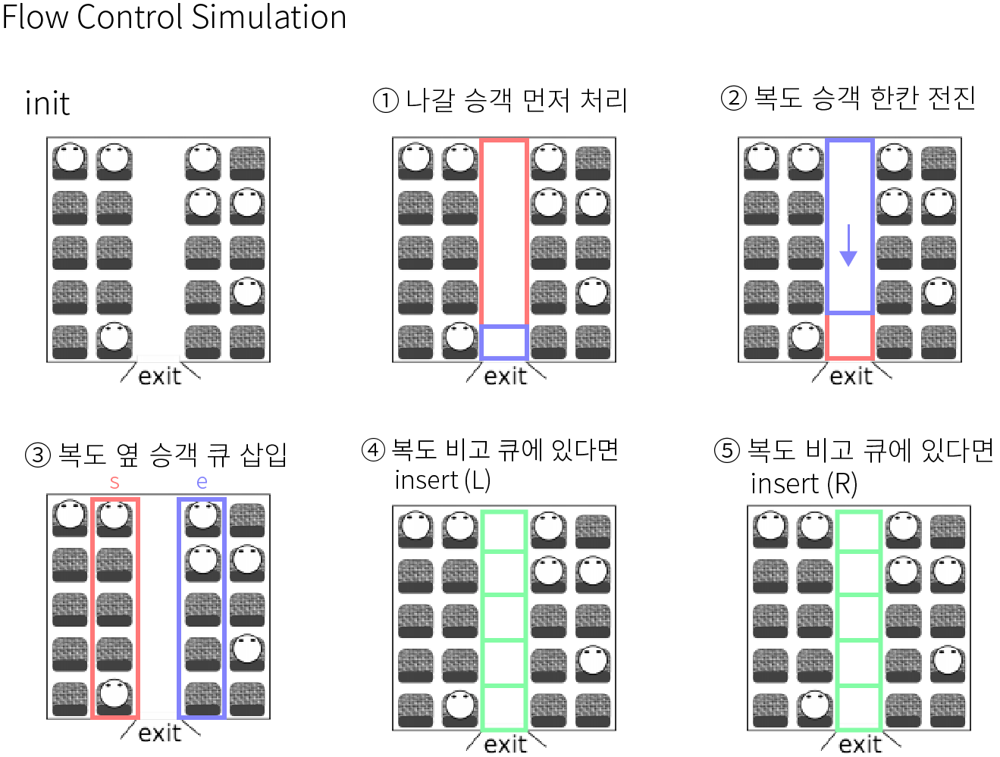

## 알고리즘 - Emergency Evacuation

 1. LINE 별 큐를 선언할 줄 아는 생각 (queue<int> q1[MAX])

 2. 일단 큐에 넣어두고, 새로 순회하며 생각할 줄 아는 능력

```
for (i = 1; i <= r; i++) { 
// 복도가 비어있고, 라인별 큐에 사람이 있다면
	if (b[i] == 0 && !q1[i].empty()) {
		// 큐 하나 빼자
		b[i] = q1[i].front();
		q1[i].pop();
	}
}
```

 3. Flow를 처리할 때 아주 세세하게 처리하는 아주 좋은 예시. 잘 보고 익히자
 
 

 ## 알고리즘 - 에디터

  - 연결리스트 응용한 Nice한 문제.

  - 초기 전제 조건, l배열과 r배열을 초기화해야함.
  - 현재 커서 위치는 고정으로 남겨둬야함. size = 4라면, p는 5를 가리킨 채로 시작.

```
for (int i = 0; i < s.length(); i++) {
        c[++m] = s[i];
        l[m] = m - 1;
        r[m] = m + 1;
}
int p = ++m;
l[p] = m - 1;
int i, j = 1;
```


 - insert 시 새로운 문자는 배열의 맨 끝 인덱스에 추가된다. (커서 뒤)
```
// insert
if (k == 'P') {
    char x;
    cin >> x;
    c[++m] = x;
	// insert나 delete나 현재 커서의 앞 idx를 표시하는 i = l[p];
    i = l[p];
	// 이 조건이 어려운데 내일 다시 만져봐야 알듯.
    if (j == p)j = m;

	// 모양이 깔끔한데 일단 다시 외워두고. 이건 이해함.
    r[i] = m;
    l[p] = m;
    l[m] = i;
    r[m] = p;
}
```
 - delete는 
```
// delete
if (k == 'B') {
    i = l[p];
    if (i == 0) continue;
	// 이것도 마찬가지. j가 하는 역할이 뭐지?
    if (j == i)j = p;

	// delete는 r배열과 l[p] 배열만 바뀐다는거 알아둬라.
    r[l[i]] = p;
    l[p] = l[i];
}
```

## 20. 07. 20 (월)

 - 점심 식사시간, 차량 정비소, 모노미노도미노류의 Flow 문제 다시다시 풀어보자!