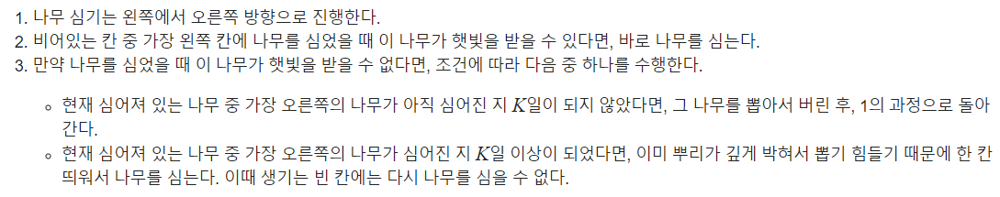

 ## 알고리즘 - Mason's Mark :dizzy_face:

  - A, B, C 찾는 빡구현 문제

```
    if(map[i][j]가 점이라면){
        if(map[i+1][j+1]가 #이고, x,y가 생성될 조건(길이 최소 3 이상)을 만족할 경우){
            while(대각선 값이 '.'일때까지) getDiag++;
            
            x,y값 다 찾으면
        }
        현재 위치에서 bound_check;

        bound가 보장이 되면 checkA or checkB or checkC

        체킹한 영역은 check 표시 But 빈칸 안에서 A 찾는 로직의 틀을 구현못함.. 39% die
    }

```
  - :zap: boundary만 4방향 순회하며 체킹하는 코드 다시 Review

```
  bool check_bound(int sx, int sy, int x, int y) {
	int px = sx, py = sy, nx, ny;
	int row_bound = sx + (3 * x + 2 * y + 2);
	int col_bound = sy + (2 * x + y + 2);
	bool isok = true;
	for (int d = 0; d < 4; d++) {
		if (!isok) break;

		// 아 nx를 여기서 선언하는구나?
		while (1) {
			nx = px + dx[d];
			ny = py + dy[d];
			if (nx >= row_bound || nx < sx || ny >= col_bound || ny < sy) break;
			if (map[nx][ny] != '.') {
				isok = false; break;
			}
			px = nx;
			py = ny;
		}
	}
	return isok;
  }
```

## 알고리즘 - 나무를 심어볼까요?(CF SKH Camp) :evergreen_tree:

 - 스택을 사용하여 해결, 스택에 {높이, 심는시간, 위치} 를 넣어주는 것이 핵심

 - 

 - 스택이 비면 값을 넣어주고, 위 그림에서 반복하는 과정을 while문과 flag를 사용하여 해결했다. 나무를 심으면 while문 빠져나오고 아니라면 반복

## 알고리즘 - 전화번호 목록(2) :v:

 - trie를 구조체가 아닌 이차원 배열로 구성하여 dfs로 짜는 방법!

```
1. trie 업데이트
void update(int n, char* k){
	// trie의 문자가 끝이라면
	if(*k == 0){
		// 끝지점을 표시해 주고 return
		check[n] = 1;
		return;
	}
	else{
		if(trie[n][c]) update(trie[n][c], ++k);
		else{
			trie[n][c] = ++m;
			update(m, ++k);
		}
	}
}

2. 검사
bool f(int n, char* k){
	if(*k == 0) return 0;
	if(check[n]) return 1;
	int c = *k - '0';
	return f(trie[n][c], ++k);
}
```
 - 이렇게 하면 메모리 1/10, 속도 :zap:
 
##### 공부해야 할 것! :evergreen_tree:

 Q. 연결리스트 구성법 l, r 배열과 e.prev 써서 구성하는 방법의 차이는?

 - Tree 구성법 다시 다시 익혀야 풀수있다.

 - 숭고한 캠프는 Trie 구조 외워야 비벼볼수있을것같다..

 ## 20. 07. 24(금)

  - 알고리즘 다시 흥미 가져야 한다.. 달리자.
  


 