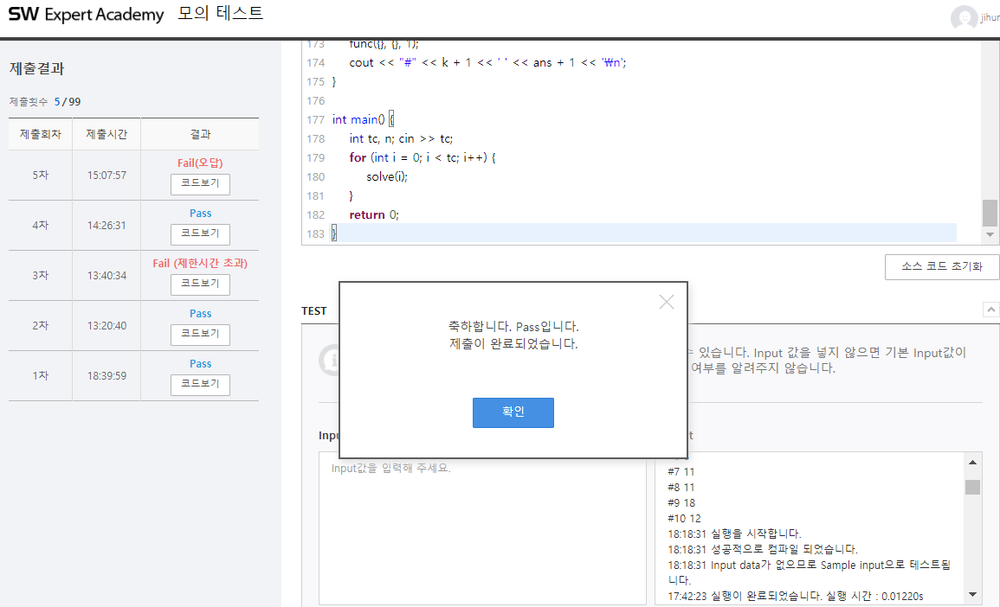

## 알고리즘 - 점심 식사시간(2) :rice_ball:

 1. 사람이라면 사람의 좌표를 사람벡터에 넣을 수 있는가?
    - 계단이라면 계단 pair에 넣을 수 있는가?

 2. 0-1 dijkstra로 각 계단에서 사람까지 거리를 나타낸 배열 d1, d2를 구할 수 있는가?
    - noSTL 통하여 dijkstra 구현 습관화
 
 3. a[i], b[i] 배열을 정의할 수 있는가?
    - a[i] : i번째 사람이 1번 계단에 다다르는 시간
    - b[i] : i번째 사람이 2번 계단에 다다르는 시간

 4. **특정 인원을 적절히 vector a, b에 나누는 코드를 짤 수 있는가?**

```
    void f(vector<int> aa, vector<int> bb, int depth){
        if(depth > people.size()){
            // Flow Simulation Code 대입
            return;
        }
        // aa에는 depth번 사람이 1번계단에 다다르는 시간이 들어간다.
        aa.push_back(a[depth]);
        f(aa, bb, depth+1);
        // 이 자리엔 오로지 aa 벡터에만 사람이 다 들어간 후 나오는 자리이다.
        // 이때 aa의 맨 끝값을 없애주고 이를 bb 벡터에 하나씩 넣어간다.
        aa.erase(--aa.end()) 
        // aa.end()는 upper_bound(rbegin())을 의미하므로 맨 끝값보다 +1을 가리킴
        // 그래서, 반드시 --aa.end()를 해줘야 마지막 값이 빠진다.
        bb.push_back(b[depth]);
        f(aa, bb, depth+1);
    }
```

 5. **Flow Simulation Code를 짤 수 있는가?** :fire:

```
    // 전제조건 : 각 계단 별 계단으로 유입되는 사람의 시간을 sort 한 값을 가지고 있어야 함.
    sort(aa); sort(bb);

    // for문으로 시간을 한틱 씩 늘려가며 확인하는 습관
    for(time = 0; ; time++){
        // Flow는 유입이 있으면 반드시 나감이 존재한다. 나가는 경우를 먼저 코딩한 후
        // 들어오는 경우를 고려하자!
        // 시간에 들어오고 나가는 경우가 중복된 경우가 있으므로, for({while()}) 구조 사용 익숙해지기.

        //★ 큐에 사람이 남아있는데 해당 사람이 나가야 할 시간과 현재 시간이 겹치거나 작은 경우 pop()★
        while(r1 >= f1 && q[f1] == time) q[f1++]; // noSTL version
        (= while(!q.empty() && q.front() == time) q.pop()) // STL version
        

        // 나가는 경우 코딩했으니 들어오는 경우 구현, 들어오는 사람의 수를 변수로 따로 관리(j)하기
        // q.size() < 3 은 ★noSTL로 r - q < 2★ 로 구현할 수 있다. 차이 조심하기!

        // 큐 사이즈가 3보다 작고, 계단에 들어온 사람의 수가 현재 들어가야 할 사람의 수보다 작으며
        // 현재 들어와야 할 사람의 시간이 현재 시간보다 같거나 작아야만 계단 입성 조건이 된다.
        while(r - q < 2 && j < aa.size() && aa[j] <= time){

            // Flow 시에 끝나는 시간값을 넣어두는 습관 가져라.
            q[++r] = time + 계단의 길이값(map[s1.x][s1.y]);
        }

        // 끝나는 조건
        // 계단에 가야하는 사람만큼 이동했고, 계단에 있는 사람이 없는 경우(모두 이동한 경우) break!
        if(j == bb.size() && r < f) break;
    }

    ans = min(ans, time);
    답은 ans + 1 !
```

- 고생 끝 구현 완료!
- 

## 20. 07. 26(일)
 
 - 내가 뭘 모르는지, 뭘 알아야 하는지 명확한 정의를 내리도록 하는 습관 가지기
 - 다음주부터 또 바쁠텐데 큰일났다~