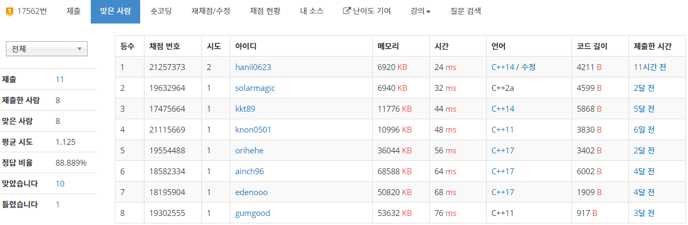

## 알고리즘 - Mason's Mark :house_with_garden:

 - LOGIC

```
    맵 전체를 순회하며
        if(빈칸이라면?)
            if(대각선 칸이 검은색이 아니라면) continue
            if(현재 칸 + 3이 맵 범위를 벗어난다면?) continue
            if(대각선 칸 + 2, +3이 검은색이 아니라면?) continue
            // 여기서부턴 최소 2x+y 생성 조건(변의 생성조건)이 된다.
            while(검은색 첫 부분부터 끝까지) 인덱스++
            while(흰색이 나올때까지) 대각선 인덱스++
            이로서 x와 y값이 fix된다.
            x = getDiag; y = getRow - 2 * x;
            // 빼기연산이므로, 혹시 마이너스일 경우 continue;
            if(y < 0) continue;

            if(!bound_check) continue; // 흰색 범위 체킹
            // 모든 조건이 성립됬으니, A, B, C 체킹 함수를 만든다.

```

 - ##### 11명이지만 자랑스러운 1등! :one: :thumbsup:

 

 CODE

```
#include<iostream>
#include<string>

using namespace std;

int w, h, a, b, c;
char map[1005][1005];
int check[1005][1005];
int dx[8] = { 0, 1, 0, -1, -1, -1, 1, 1 };
int dy[8] = { 1, 0, -1, 0, -1, 1, 1, -1 };

bool noise_check(int x, int y) {
	for (int i = 0; i < 8; i++) {
		int nx = x + dx[i];
		int ny = y + dy[i];
		if (map[nx][ny] == '#') return false;
	}
	return true;
}

bool checkA(int sx, int sy, int x, int y) {
	int rsize = sx + 3 * x + 2 * y;
	int csize = sy + 2 * x + y;

	for (int i = sx; i < rsize; i++) {
		for (int j = sy; j < csize; j++) {
			if ((sx <= i && i < sx + x) || (sx + x + y <= i && i < sx + 2 * x + y)) {
				if (map[i][j] == '.') return false;
			}
			else if (sx + x <= i && i < sx + x + y) {
				if ((sy <= j && j < sy + x) || (sy + x + y <= j && j < csize)) {
					if(map[i][j] == '.') return false;
				}
				else {
					if (map[i][j] == '#') {
						if (!noise_check(i, j)) return false;
					}
				}
			}
			else if (sx + 2 * x + y <= i && i < rsize) {
				if ((sy <= j && j < sy + x) || (sy + x + y <= j && j < csize)) {
					if (map[i][j] == '.') return false;
				}
				else {
					if (map[i][j] == '#') {
						if (!noise_check(i, j)) return false;
					}
				}
			}
		}
	}
	return true;
}
bool checkB(int sx, int sy, int x, int y) {
	int rsize = sx + 3 * x + 2 * y;
	int csize = sy + 2 * x + y;

	for (int i = sx; i < rsize; i++) {
		for (int j = sy; j < csize; j++) {
			if ((sx <= i && i < sx + x) || (sx + x + y <= i && i < sx + 2 * x + y) || (sx + 2 * x + 2 * y <= i && i < rsize)) {
				if (map[i][j] == '.') return false;
			}
			else if ((sx + x <= i && i < sx + x + y) || (sx + 2 * x + 2 * y <= i && i < rsize)) {
				if ((sy <= j && j < sy + x) || (sy + x + y <= j && j < csize)) {
					if (map[i][j] == '.') return false;
				}
				else {
					if (map[i][j] == '#') {
						if (!noise_check(i, j)) return false;
					}
				}
			}
		}
	}
	return true;
}
bool checkC(int sx, int sy, int x, int y) {
	int rsize = sx + 3 * x + 2 * y;
	int csize = sy + 2 * x + y;

	for (int i = sx; i < rsize; i++) {
		for (int j = sy; j < csize; j++) {
			if ((sx <= i && i < sx + x) || (sx + 2 * x + 2 * y <= i && i < rsize)) {
				if (map[i][j] == '.') return false;
			}
			else {
				if ((sy <= j && j < sy + x)) {
					if (map[i][j] == '.') return false;
				}
				else {
					if (map[i][j] == '#') {
						if (!noise_check(i, j)) return false;
					}
				}
			}
		}
	}
	return true;
}
bool check_bound(int sx, int sy, int x, int y) {
	int px = sx, py = sy, nx, ny;
	int row_bound = sx + (3 * x + 2 * y + 2);
	int col_bound = sy + (2 * x + y + 2);
	bool isok = true;
	for (int d = 0; d < 4; d++) {
		if (!isok) break;
		while (1) {
			nx = px + dx[d];
			ny = py + dy[d];
			if (nx >= row_bound || nx < sx || ny >= col_bound || ny < sy) break;
			if (map[nx][ny] != '.') {
				isok = false; break;
			}
			px = nx;
			py = ny;
		}
	}
	return isok;
}

void solve(int sx, int sy, int ssx, int ssy, int mode) {
	if ((ssy - sy < 5) || ssx - sx < 7) return;
	for (int i = sx; i < ssx - 1; i++) {
		for (int j = sy; j < ssy - 1; j++) {
			int px = i, py = j;
			if (check[px][py]) continue;
			if (map[px][py] == '.') {
				int getRow = 0, getDiag = 0, x, y;
				if (map[px + 1][py + 1] != '#') continue;
				if (py + 3 > ssy - 1) continue;
				if (!(map[px + 1][py + 2] == '#' && map[px + 1][py + 3] == '#')) continue;
				while (map[px + 1][py + 1 + getRow] == '#') getRow++;
				while (map[px + 1 + getDiag][py + 1 + getDiag] == '#') getDiag++;
				x = getDiag;
				y = getRow - 2 * x;
				if (y < 0) { continue; }

				if (!check_bound(px, py, x, y)) continue;
				
				if (checkA(px + 1, py + 1, x, y)) {
					a++;
				}
				else if (checkB(px + 1, py + 1, x, y)) b++;
				else if (checkC(px + 1, py + 1, x, y)) c++;
				
				// check
				for (int kx = px + 1; kx < px + 1 + 3 * x + 2 * y; kx++) {
					for (int ky = py + 1; ky < py + 1 + 2 * x + y; ky++) {
						check[kx][ky] = 1;
					}
				}

			}
		}
	}
}
int main() {
	ios_base::sync_with_stdio(0); cin.tie(0);
	cin >> w >> h;
	for (int i = 0; i < h; i++) {
		string a; cin >> a;
		for (int j = 0; j < a.size(); j++) {
			map[i][j] = a[j];
		}
	}

	solve(0, 0, h, w, 0);
	cout << a << ' ' << b << ' ' << c;
	return 0;
}
```

## 알고리즘 - 집배원 한상덕(BFS + Parametric Search)

 1. 8방향 bfs

 2. 편지를 배달하고 난 이후 **다시 우체국으로 돌아와야 한다**

    - 갈 수 있으면 반드시 돌아올 수 있음이 보장되므로, 따로 처리 :negative_squared_cross_mark:

 3. 이 문제가 플레티넘인 이유

    - 배달하면서 방문한 칸 중 가장 높은 곳과 낮은 곳의 고도차이가 최소가 되면서 모두 방문해야함.

    + 이땐 모든 고도값들을 sorting , left값을 고정시킨 후 Parametric Search를 하며 naive한 bfs를 써야만 해결가능하다.

    + 모두 순회 가능한 최소 높이차를 r이라 하면 r+1의 높이차는 모두 방문 가능함이 보장된다. 따라서 위 방법을 적용하면 해결가능하다.

## 알고리즘 - 신입 사원

  - 점수 분포가 비슷한 사원을 같은 "팀"으로 배정. 점수가 가장 높은 사원과 낮은 사원의 점수 차가 max_diff 이하인 팀을 구성할 때 가장 인원이 많은 팀의 수는?

  - ###### **O(nlogn)으로 풀때 TLE를 받았고 답은 O(n+10000)!**

  - **prefix sum 배열 이용을 습관화** 하자.

```
    // 해당 점수를 받은 사람 수 체킹
    for(auto x : grade) d[x]++;

    // 점수가 i 이하인 사원의 수
    for(int i = 1; i <= 10000; i++)
        s[i] += s[i-1] + d[i];
    
    // prefix sum을 이용해 사람 수를 찾는 테크닉 진짜 미쳤다~
    for(int i = maxdiff+1; i<=10000; i++)
        ans = max(ans, s[i] - s[i - maxdiff - 1]);
```

## 20. 07. 27(월)
 - 실력 조금씩 늘고 있는것같은데.. 그래도 계속 하자!
 - 1등은 첨해봐서 기쁘다 ~
    


            

            